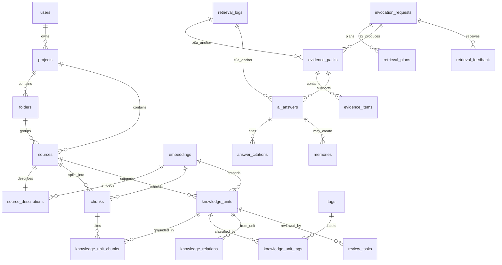

# 数据模型 v0.24-draft

版本：v0.24-draft
日期：2026-05-17  
状态：草案——完整 P0 入库与知识处理平台 + 切片前准备层 / 切片执行 profile / AI 结构化整理 profile / D-079 结构化整理子字段与存储映射 / D-080 知识调用 profile 与隐式 Agent / D-081 调用持久化边界 / D-082 InvocationProfileSchema v1 / D-083 前端状态与反馈策略 / D-085 Z0a 调用锚点、反馈和 citation 边界修正 / D-092 trace chain 与 Evidence Pack 失败态 / D-104 Retrieval Preview 复用既有调用对象 / D-107 feedback_events 与 memories Z0b-lite 物理表 / D-108 feedback_events 诊断读取与 Event Replay / D-113 citation_annotations 批注与 evidence compare 只读边界 / 知识切片质量闭环 / 安全运维横切层 / 检查门映射单一来源 / 事件枚举单一来源 / P0-Z0a/Z0b 最小迁移 / ProcessingJob / sensitive grant / evidence-only 契约收紧

## 1. 文档目的

本文档定义 AI 个人知识资产系统的第一版数据模型草案。

它服务三个目标：

- 统一知识构建域、知识调用域和共享底座的数据对象。
- 为 Text-to-SQL、RAG、Citation Preview、Evidence Pack 和 Memory Review 提供稳定对象边界。
- 在进入 API 和代码实现前，先明确字段、关系、只读视图、状态枚举和冻结门槛。

本文档不是数据库迁移文件，也不代表最终稳定 Schema。

---

## 2. 设计原则

### 2.1 Knowledge Unit 是核心资产

Source 是来源，Chunk 是证据片段，Knowledge Unit 才是可复用、可确认、可调用的知识资产。

### 2.2 建库域写入，调用域默认只读

建库域负责创建、确认和沉淀知识。调用域默认只读取已确认、权限允许、可供 Agent 使用的知识。

调用域输出必须通过 Review 才能成为 Memory 或 Knowledge Unit。

### 2.3 结构化字段优先

以下信息必须结构化，不能只埋在自然语言中：

- project / knowledge space
- folder
- source
- status
- permission
- user verification
- tags
- knowledge type
- relation type
- source location
- embedding profile
- retrieval trace

### 2.4 P0 SQLite 类型映射

P0 采用 SQLite 作为本地数据库（详见 `docs/desktop-architecture.md` §4）。以下类型描述是逻辑类型，SQLite 的实际映射：

| 逻辑类型 | SQLite 存储 | 说明 |
|---|---|---|
| uuid | TEXT | 存储 UUID 字符串 |
| timestamptz | TEXT | ISO 8601 格式（`2026-05-12T12:00:00Z`） |
| text[] / uuid[] | TEXT (JSON array) | `["a", "b"]`，通过 `json_each()` 查询 |
| jsonb | TEXT (JSON) | SQLite JSON 函数查询 |
| vector | BLOB | sqlite-vec 格式，P0 为 mock |
| numeric | REAL | 浮点数 |
| integer | INTEGER | 整数 |
| boolean | INTEGER | 0/1 |
| text | TEXT | 文本 |

P1 迁移到 PostgreSQL 时，Repository 抽象层负责适配类型差异。

### 2.5 metadata_json 使用约束

`metadata_json` 仅用于存储**真正不确定、未来可能出现的扩展属性**，不应作为逃避 Schema 设计的万能字段。

约束规则：

- 如果某个属性在 3 个以上对象中重复出现，应提取为独立结构化字段。
- P0 各表 `metadata_json` 的预期用途必须在字段说明中注明，不允许空白用途。
- Text-to-SQL 不查询 `metadata_json` 内部字段（P0 限制）。

### 2.6 桌面单用户 + 账号预埋（P0）

P0 是桌面软件，默认单设备单用户，但必须预埋账号能力。数据模型上：

- `users` 表保留，但 P0 只有一行（默认 local user，启动时自动创建）。
- 所有业务表的 `user_id` 字段保留，作为 P1 多设备同步 / 云端账号的预埋字段。
- P0 API 隐式 `user_id = current_user`，前端不暴露用户切换。
- `permission` 字段在单用户场景下意义弱化，但保留，避免 P1 多用户场景再加字段。
- `user_profiles`、`auth_identities`、`roles`、`access_policies` 进入 P0 schema，真实注册 / 登录 / Token 写入接口返回 `auth_not_enabled_in_p0`。

实现层约束：

- P0 Repository 默认注入 `user_id`，无需每个 API 显式传递。
- P0 不实现用户登录、注册、找回密码、多用户切换等真实流程，但 `GET /api/auth/status` 必须可解释当前账号能力状态。
- P1 进入多设备同步时再扩展 `auth_credentials`、`devices`、`sync_state` 等表。

### 2.7 Embedding 独立记录

P0 草案采用统一 `embeddings` 表承载三类 embedding（owner_type + owner_id 多态关联）：

```text
source_description
chunk
knowledge_unit
```

P0 embedding profile 优先级：

```text
bge_m3_local（provider 可用时）
mock_fixed_384（provider 缺失或禁用时 fallback）
```

`mock_fixed_384` 只验证写入、查询、排序和引用链路，不用于真实语义召回质量验收。无论使用真实 provider 还是 mock，都必须在 `embeddings` 表中记录 `provider_key`、`embedding_profile`、`model_id`、`capability_status` 和 `fallback_reason`。

### 2.8 向量存储与 RAG 检索路径（已确认）

本产品需要 **Embedding** 与 **RAG**，但 **P0 不采用独立向量数据库**（如 Pinecone、Milvus、云向量专库等与主库分离的部署形态）。

**已确认策略（D-063）**：

- **向量存哪里**：统一写入 `embeddings` 表，逻辑类型 `vector` 在 SQLite 中为 **BLOB**，通过 **sqlite-vec** 做相似度检索；与 Source / Chunk / Knowledge Unit 的关联仍走关系型主键与 `owner_type + owner_id`。
- **主库角色**：**SQLite 是单一主存储**：结构化行、JSON、全文（FTS5）、向量索引（sqlite-vec）同属一个本地数据库文件，实现 **混合检索**（SQL / 标签 / 文件夹 + 关键词 + 向量 + 关系扩展的组合由调用域编排）。
- **RAG 是什么**：RAG 是 **检索 → 证据组装（Evidence Pack）→ Citation → RAG answer / evidence-only fallback** 的流水线；向量检索是其中一条通道，**不等于**单独再建一套「向量数据库产品」。
- **P0-AI / P0-RAG 执行口径**：`embeddings` 表、`EmbeddingRepository` 和向量检索抽象属于 P0-AI；Evidence Pack、Citation 和 Answer/Fallback 属于 P0-RAG；sqlite-vec 运行时可以降级，但不能删掉向量存储 Schema 与向量检索接口。
- **P1 演进**：若规模或延迟不足，经 Repository 抽象层评估迁移至 **PostgreSQL + pgvector**，仍优先 **一库混合**，不强制引入独立向量服务；若未来确有需求再单列评估 Qdrant / LanceDB 等本地引擎。

详见 `docs/rag-pipeline.md`、`docs/technical-stack-and-prototype-plan.md` §2.1、`docs/product-architecture.md` §4.0 P0 数据层说明。

### 2.8.1 D-079 数据库存储系统映射

新图中的“数据库存储系统”按逻辑职责进入 P0，不改变 D-063 的主库混合策略。P0 仍使用本地文件系统 / StorageAdapter + SQLite + FTS5 + sqlite-vec；PostgreSQL / MySQL / MongoDB、Qdrant / Milvus / Weaviate / Chroma、Neo4j / NebulaGraph / NetworkX 只作为 P1/P2 迁移或 adapter 评估项。

| 逻辑模块 | P0 写入位置 | P1/P2 迁移或 adapter | 边界 |
|---|---|---|---|
| 原始文件存储 | `files.storage_path` + local StorageAdapter；`files.metadata_json` 记录格式、大小、hash、上传时间 | MinIO / S3-compatible / OSS | 原文件不参与 citation 替代，只作为 Source 证据来源 |
| 文本内容存储 | `sources`、`chunks`、`chunks.source_location`、`chunks.metadata_json` | PostgreSQL / MongoDB 评估 | 解析文本、清洗文本、知识切片和段落/页码位置必须可追溯 |
| 元数据存储 | `sources.metadata_json`、`chunks.metadata_json`、`knowledge_units.metadata_json`、`tags` 和 join 表 | PostgreSQL / MySQL | 标题、作者、标签、分类、项目归属和时间字段先以主库结构化字段 + JSON 表达 |
| 向量数据库模块 | `embeddings` + sqlite-vec + FTS5 + metadata filter | PostgreSQL + pgvector；独立向量服务仅 P2 评估 | P0 不引入独立向量数据库服务 |
| 图数据库模块 | `review_tasks(target_type=relation_suggestion)`；P0-Z1 后写 `knowledge_relations` | Neo4j / NebulaGraph / NetworkX / RDFlib | 关系候选必须 Review；未确认关系不得进入 agent_default |
| 用户行为 / 反馈存储 | `feedback_events`、`audit_logs`、必要时 `knowledge_units.metadata_json.weighting` | Redis 仅作 P1 缓存/队列 | 点击、收藏、有用/无用、修改记录和权重变化必须可审计 |
| 任务状态存储 | `processing_jobs` + `processing_status_events` | Celery / Redis / BullMQ / Temporal | P0 默认 `local_sqlite_worker`，失败原因和重试记录必须可恢复 |

### 2.8.2 D-080/D-081/D-082/D-083 知识调用 profile 与前端状态映射

D-080 不新增大表，不改变 P0 SQLite + sqlite-vec + FTS5 主库混合策略。D-081 进一步收紧 P0-Z0a / P0-Z2 的持久化边界：P0-Z0a 只必须持久化 `retrieval_logs`、`evidence_packs`、`evidence_items` 和 `ai_answers(output_type=evidence_only_answer)`；`invocation_requests`、`retrieval_plans`、`memories`、`retrieval_feedback` 是 P0-Z2 对象，或作为提前实现的可选增强，不能拖慢 Z0a blocking migration。D-082 固定 `InvocationProfileSchema v1`；D-083 固定前端状态和反馈策略契约。D-085 进一步规定：Z0a 的 Evidence / Answer 以 `retrieval_log_id` 和 `evidence_pack_id` 作为可实现锚点，`request_id` / `retrieval_plan_id` 在 Z0a 可为空；Z0a 只允许 append-only `feedback_events` 或 response-only feedback summary，不创建 `retrieval_feedback`；Z0a 返回 evidence item / citation trace summary，不返回持久化 `answer_citation_id`。D-104 不新增表，`POST /api/retrieval/preview` 与 `POST /api/retrieval/evidence-only` 复用同一 confirmed KU → Evidence Pack → Citation Trace 链路，`GET /api/evidence-packs/{id}` 只读取既有 pack/item 记录。D-107 将 `feedback_events` 和 `memories` 作为 Z0b-lite 物理表提前实现：feedback 仍只 append-only，不写 `retrieval_feedback`；Memory Draft 必须进入 Review，确认前不进入检索。

| D-080 逻辑对象 | P0 写入位置 | 说明 |
|---|---|---|
| `query_understanding_profile` | Z0a 写 `retrieval_logs.filters_json.query_understanding_profile` 和 API response summary；Z2 再写 `retrieval_plans.metadata_json` | intent、query rewrite、关键词、范围、约束、输出格式和置信度 |
| `retrieval_strategy_profile` | Z0a 写 `retrieval_logs.filters_json.retrieval_strategy_profile` 和 API response summary；Z2 再写 `retrieval_plans.metadata_json` | 问题类型到 BM25 / vector / metadata / file index / relation evidence / hybrid 的路线 |
| `ranking_profile` | `retrieval_logs.ranking_scores`、`evidence_packs.ranking_summary` | hybrid score、source reliability、recency、feedback weight、reranker fallback |
| `citation_trace_profile` | `evidence_items`、`answer_citations`、`ai_answers.metadata_json.citation_trace_profile` | Chunk / Source / File / text span / citation confidence / source reliability |
| `feedback_signal` | `feedback_events`；Z2 可同步到 `retrieval_feedback` | click、favorite、useful、not useful、bad citation、missing source；只影响排序建议，不改 confirmed knowledge |
| `implicit_agent` | Z0a 写 `ai_answers.metadata_json.agent_context`；Z2 的 `invocation_requests.agent_id` 仍固定 null | P0 只有隐式主 Agent，不创建可配置 Agent 实体 |
| `frontend_state_contract` | API response summary + `processing_status_events` / `system_logs` | 上传进度、AI 思考、检索失败、无权限、网络异常、空结果、citation 和反馈按钮状态 |

### 2.8.3 D-092 trace chain 与 Evidence failure 映射

D-092 不新增首批平级大表，但要求 P0-Z0a 对象可通过同一 `trace_id` 串联。实现时可以先用结构化字段保存 `trace_id`；若某些 Z0a response-only 对象暂不落库，也必须在 API response 和诊断日志中保留同一链路。

```text
trace_id
→ request_id
→ job_id
→ event_seq
→ retrieval_log_id
→ evidence_pack_id
→ ai_answer_id
```

落库规则：

- `processing_jobs` 和 `processing_status_events` 必须可关联到同一 `trace_id`，用于上传、解析、切片、embedding 和 RAG answer 的诊断聚合。
- `retrieval_logs`、`evidence_packs`、`ai_answers` 建议直接结构化保存 `trace_id`；`request_id` 在 Z0a 可为空或只存在于 response/log summary。
- Evidence Pack 失败态使用 `evidence_packs.failure_type` 表达：`no_retrieval_result / insufficient_evidence / permission_blocked / citation_binding_failed / vector_degraded`。
- 除 `vector_degraded` 且证据仍充分的 evidence-only 降级场景外，Evidence Pack 出现不可回答失败态时不得写入伪答案；D-104 兼容 endpoint 可写入 `ai_answers(output_type=evidence_only_answer)` 保存 no evidence reason，但 `evidence_item_ids_json` 必须为空且不得生成来源外内容。

D-082 profile envelope 是所有调用 profile 的最小外壳：

```yaml
profile_envelope:
  profile_key: string
  profile_version: v1
  schema_version: invocation_profile_schema_v1
  provider_key: system_rules | local_adapter | open_source_provider | commercial_provider | null
  capability_status: available | fallback | unavailable | disabled | error
  fallback_reason: string | null
```

推荐 profile 子结构：

```yaml
query_understanding_profile:
  intent: simple_fact | concept_explanation | relationship_analysis | summary_synthesis | timeline | file_lookup | complex_hybrid
  query_rewrite:
    rewrite_status: not_needed | rule_rewrite | provider_rewrite | fallback | failed
    rewritten_query: string | null
    provider_key: rule | local_llm | commercial_llm | null
    capability_status: available | fallback | unavailable | disabled | error
    fallback_reason: llm_unavailable | low_confidence | not_needed | null
  extracted_keywords:
    exact_terms: [string]
    entities: [string]
    project_hints: [string]
    time_hints: [string]
  scope_filters: object
  constraints:
    permission_mode: agent_default | user_preview | explicit_sensitive_confirmed
    output_format: answer | evidence_only | outline | table | summary | citation_preview
  confidence: number

retrieval_strategy_profile:
  route: bm25 | vector | metadata_filter | file_index | relation_evidence | summary_chain | hybrid
  route_reason: simple_fact | concept_explanation | relationship_analysis | summary_synthesis | timeline | file_lookup | complex_hybrid
  channels:
    keyword: enabled | disabled
    vector: enabled | fallback | disabled
    metadata: enabled | disabled
    relation: enabled | fallback | disabled
    summary_chain: enabled | fallback | disabled
  fallback_reason: vector_unavailable | graph_not_in_p0 | reranker_unavailable | provider_missing | null

ranking_profile:
  merge_strategy: weighted_sum | reciprocal_rank_fusion | rule_merge
  weights:
    keyword_score: number
    vector_score: number
    metadata_match: number
    source_reliability_score: number
    recency: number
    feedback_weight: number
  reranker:
    provider_key: bge_reranker_v2 | jina_reranker | null
    capability_status: available | fallback | unavailable | disabled | error
    fallback_reason: reranker_unavailable | not_configured | null

citation_trace_profile:
  source_binding_status: bound | partial | missing
  citation_targets:
    knowledge_unit_ids: [uuid]
    chunk_ids: [uuid]
    source_ids: [uuid]
    file_ids: [uuid]
  source_locations:
    - source_id: uuid
      chunk_id: uuid | null
      page_number: integer | null
      section_title: string | null
      text_span: string | null
  citation_confidence: number
  source_reliability_label: official | user_confirmed | uploaded | ai_generated | unknown

feedback_signal:
  signal_type: click | favorite | useful | not_useful | bad_citation | missing_source | downrank_source
  target_type: evidence_pack | evidence_item | ai_answer | citation | knowledge_unit | source
  ranking_effect: positive | negative | neutral
  applies_to_next_retrieval: boolean
  feedback_policy:
    storage_scope: local_only
    effect_scope: current_project | current_knowledge_space | global_user_profile
    retention_days: integer | null
    weight_cap: number
    opt_out: boolean
    requires_review_for_global_weight: boolean

frontend_state_contract:
  surface: upload | file_processing | chunking | extraction | embedding | retrieval | rag_answer | citation | feedback
  state: idle | loading | empty | done | recoverable_error | blocked | fallback
  event_source: processing_status_events | retrieval_response | rag_response | system_status
  user_action: retry | confirm_sensitive | inspect_source | open_citation | send_feedback | none
```

GraphRAG、Learning-to-Rank、外部图数据库和多 Agent 自主执行只作为 P1/P2 adapter 或训练数据评估，不进入 P0 默认依赖。P0 只能把 confirmed relation 或 relation suggestion evidence 作为 `relation_evidence`，不得宣称已启用 GraphRAG runtime 或自动关系扩展。

### 2.9 Provider capability 与 fallback 记录

P0 不新增独立 provider 配置表，避免把架构细化变成配置系统膨胀。Provider 可用性由 `GET /api/ai-providers/capabilities` 动态返回，业务对象只在现有字段或 `metadata_json` 中记录执行痕迹。

所有涉及文件检查、解析、清洗、embedding、rerank、RAG answer 的对象，至少要能保存以下信息：

```text
provider_key        -- libmagic / charset-normalizer / qpdf / oletools / pymupdf / pdfplumber / paddleocr / whisper / bge-m3 / mock / local_llm ...
provider_version    -- runtime probe 或 adapter 版本
profile             -- mime_probe / security_scan / pdf_text / table_extract / bge_m3_local / mock_fixed_384 / evidence_only ...
capability_status   -- available / fallback / unavailable / disabled / error
fallback_reason     -- preview_unavailable / ocr_unavailable / asr_unavailable / mock_fixed_384 / rag_provider_missing ...
```

落表规则：

- `upload_tasks.metadata_json`：记录 `upload_adapter=uppy`、`protocol=tus_style`、`status_channel=sse`。
- `files.metadata_json`：记录 `storage_adapter=local_fs`、`s3_compatible_contract=true`、格式探测和风险检查摘要。
- `file_inspection_results`：记录真实类型、编码、安全、结构、预览、表格和媒体探测的 provider、状态、风险与产物路径。
- `ProcessingJob`（物理表可为 `ingestion_jobs`）/ `processing_status_events`：记录 `queue_adapter=local_sqlite_worker`、状态变化和 fallback reason。
- `parse_tasks` / `parse_warnings`：记录 parser / OCR / ASR / vision adapter 的 provider key、version、profile 和失败原因。
- `embeddings`：结构化记录 embedding provider、profile、model、dimension、fallback reason。
- `retrieval_logs` / `retrieval_plans` / `ai_answers`：记录 reranker、LLM、Text-to-SQL template/provider 和 evidence-only fallback。

这保证 P0 不引入 provider 配置表，也能让 Query Explanation、Citation Preview 和调试日志还原每次处理使用的能力路径。

### 2.10 Embedding profile registry 契约

`mock_fixed_384` 只属于 fallback profile，不再作为 P0 全局默认 embedding。P0 默认语义 profile 是 `bge_m3_local`，但它可以因模型未安装、运行时探测失败或用户禁用而不可用。

P0 可以先用配置 manifest 实现 profile registry；如果实现期需要落表，可创建轻量 `embedding_profiles` 表。无论采用 manifest 还是表，都必须暴露同一组字段：

| 字段 | 类型建议 | 说明 |
|---|---|---|
| profile_key | text | `bge_m3_local` / `mock_fixed_384` |
| provider_key | text | `bge-m3` / `mock` / `jina-embeddings-v3` / `openai` |
| model_id | text | 模型或 fallback 标识 |
| dimension | integer nullable | 真实 provider 由 runtime probe 写入；mock 固定 384 |
| vector_index_name | text nullable | sqlite-vec index/table 名称；多维度并存时必填 |
| is_fallback | boolean | 是否为 fallback profile |
| capability_status | text | available / fallback / unavailable / disabled / error |
| fallback_reason | text nullable | provider_capability_unavailable / model_not_installed / mock_fixed_384 |

约束：

- `embeddings.dimension` 必须来自 profile registry 或 runtime probe，不允许把 384 写成全局默认。
- 同一次 vector search 只能使用同一 dimension 的向量；跨 profile 检索需先做 hybrid merge 或分别检索后合并分数。
- profile 或 dimension 变化后，旧 embedding 进入 `stale`，通过 rebuild job 重建。

### 2.11 P0 迁移波次与 Z0 竖切

本文档中的 **P0** 表示第一轮产品架构范围，不等于第一条迁移必须一次性创建所有表。进入代码实现时采用三段式落地：

| 波次 | 目标 | 迁移口径 |
|---|---|---|
| P0-Z0a 可运行骨架 | 单文件直传或 `text_import` 能跑通：接收 → inspection summary / parse → chunk → KU Review → embedding fallback → evidence-only answer | 第一批 blocking migration / repository / contract test |
| P0-Z0b 同周补齐 | 账号预埋表、分片恢复、source description、标签/citation 明细、sensitive grant、审计日志 | 第一阶段非 blocking migration，可在 W1/W2 随同补齐 |
| P0-Z1 入库增强 | 完整 inspection report、更多 parser warning、质量事件、关系占位、上传恢复增强 | 第二批 migration，可在 W2/W3 内补齐 |
| P0-Z2 RAG 完整化 | invocation、retrieval plan、memory draft、feedback、RAG answer provider/fallback 完整复盘 | 第三批 migration，在 W5/W6 前补齐 |

约束：

- P0-Z0a 必须保持端到端可演示，不因账号预埋明细、完整分片恢复、完整 RAG / 多模态 / 复杂治理对象未完成而阻塞工程骨架。
- P0-Z0b 仍属于第一阶段 P0，但不得作为 W1 工程骨架的 blocking checklist。
- 所有 P0 对象仍保留在本文档中，但实现计划必须标注进入哪个波次。
- 后续 Alembic migration 可以按波次拆分；不得把 P0-Z2 对象写进 W1 的 blocking checklist。

---

## 3. 对象分层

本节同时作为迁移边界。实现阶段不得把候选契约对象自动理解为 P0-Z0a blocking 必建表。

| 层级 | P0 波次 | 表 / 对象 | 说明 |
|---|---|---|---|
| P0-Core | Z0a/Z0b | users, projects, folders, tags, user_profiles, auth_identities, roles, access_policies, audit_logs, system_logs | Z0a 只要求 `local_user` 和空间/标签骨架；账号预埋、审计和系统日志可在 Z0b 补齐 |
| P0-File | Z0a/Z0b/Z1 | upload_tasks, upload_parts, files, file_integrity_checks, file_inspection_results, processing_jobs(`ingestion_jobs`), processing_status_events, sources | Z0a 支持直传或 text_import 和 inspection summary；分片恢复、完整 report 和增强恢复进入 Z0b/Z1 |
| P0-AI | Z0a/Z0b/Z1 | source_descriptions, parse_tasks, parse_warnings, chunks, chunk_quality_checks, quality_events, knowledge_units, knowledge_unit_chunks, knowledge_unit_tags, knowledge_relations, embeddings, review_tasks | Z0a 先做解析、Chunk、KU、Review、Embedding；source description、标签明细、质量事件和关系逐步补齐 |
| P0-RAG | Z0a/Z0b/Z2 | retrieval_logs, evidence_packs, evidence_items, ai_answers, feedback_events, memories, answer_citations, sensitive_access_grants, invocation_requests, retrieval_plans, retrieval_feedback | Z0a 只做 retrieval log + evidence pack + `evidence_only_answer`；D-107 已提前实现 `feedback_events` append-only 与 pending-review `memories`，两者不影响真值、不进入 retrieval；citation 明细与敏感授权 Z0b；invocation plan、retrieval_feedback、LLM answer 在 Z2 补齐 |
| P1+ | 后续扩展 | version_snapshots, agents, agent_invocations, agent_memories | 版本回滚、多 Agent、多设备同步和高级反馈治理 |

### 3.1 P0-Z0a blocking 必建对象

```text
users
projects
folders
tags
upload_tasks
files
file_integrity_checks
file_inspection_results
processing_jobs            # 领域对象；P0 物理表名可暂用 ingestion_jobs
processing_status_events
sources
parse_tasks
parse_warnings
chunks
knowledge_units
knowledge_unit_chunks
embeddings
review_tasks
retrieval_logs
evidence_packs
evidence_items
ai_answers                 # P0-Z0a 仅允许 output_type=evidence_only_answer
```

### 3.1.1 P0-Z0b / P0-Z1 / P0-Z2 补齐对象

P0-Z0b：

```text
user_profiles
auth_identities
roles
access_policies
upload_parts
source_descriptions
chunk_quality_checks
knowledge_unit_tags
answer_citations
sensitive_access_grants
audit_logs
system_logs
```

P0-Z1：

```text
quality_events
knowledge_relations
```

P0-Z2：

```text
invocation_requests
retrieval_plans
memories
retrieval_feedback
```

P0-Z0a 验证闭环：Upload / text_import → File → Source → Parse → Chunk → KU → Review → Confirmed → Embedding → Hybrid Retrieval → Evidence Pack → `evidence_only_answer`。D-107 已补上 append-only Feedback Event 与 pending-review Memory Draft 回流，但 Provider 型 `rag_answer`、`retrieval_feedback`、invocation plan 和 memory retrieval 仍到 P0-Z2 再进入完整闭环。

### 3.2 `files` 与 `sources` 分工

```text
files   = 物理文件对象：路径、hash、MIME、大小、存储状态、上传任务、完整性校验、检查摘要
sources = 语义来源对象：标题、来源类型、抽取文本、权限、项目/文件夹归属、知识引用入口
```

一份上传文件可以产生一个或多个 Source；`text_import` 没有物理文件时也可以创建虚拟 file 或直接创建 Source，具体由实现阶段决定，但 API 和数据模型必须支持文件优先路径。

### 3.4 P0 只读视图

```text
v_knowledge_units_with_tags
v_retrieval_evidence
v_invocation_evidence
```

### 3.5 P1 扩展对象

```text
conversation_threads
rerank_logs
answer_versions
memory_review_tasks
agent_context_snapshots
agents
agent_invocations
agent_memories
auth_credentials
devices
sync_state
```

### 3.6 Personal Agent 实体预埋（P1 schema-only）

`AGENTS.md` 强调本项目是"个人 Agent 的能力底座"。P0 默认 single-agent assumption（一个用户隐式拥有一个主 Agent），但 P1 起需要支持多 Agent。

P1 新增表：

| 表 | 职责 | P0 行为 |
|---|---|---|
| `agents` | Agent 配置（name、role、system_prompt、可调用范围） | 不创建，隐式默认 Agent |
| `agent_invocations` | 绑定 Agent ↔ invocation_requests | 不创建，所有 invocation 默认主 Agent |
| `agent_memories` | 绑定 Agent ↔ memories | 不创建，所有 memory 默认主 Agent |

P1 schema 草案：

```text
agents
├── id (uuid)
├── user_id (uuid)
├── name (text)
├── role (text)                    -- research_assistant / creation_assistant / decision_assistant 等
├── system_prompt (text)
├── default_project_scope (uuid[]) -- 默认可访问哪些 Project
├── allowed_kb_types (text[])      -- 默认可访问哪些 kb_type
├── memory_visibility (text)       -- private / shared_with_user / shared_with_other_agents
├── status (text)                  -- active / paused / archived
├── created_at, updated_at
└── metadata_json
```

P0 不实现 Agent 表，但所有 P0 API 设计应假设未来会注入 `agent_id` 上下文：

- `invocation_requests` 未来会增加 `agent_id` 字段
- `memories` 未来会增加 `agent_id` 字段
- 检索过滤未来会按 Agent 的 `default_project_scope` + `allowed_kb_types` 收窄

P0 不需要实现可配置 Agent 实体；运行时可通过 `current_agent_id_or_null()` 保持空 Agent 归属，P1 通过 Alembic 迁移补充 `agent_id`（详见 `docs/desktop-architecture.md` §12）。

### 3.7 事件类对象分类决策树

当前数据模型有 5 类"事件/日志"对象，存在边界模糊。本节明确每类事件的归属规则。

#### 3.7.1 5 类事件对象

| 表 | 用途 | 触发时机 | 归属层 |
|---|---|---|---|
| `audit_logs` | 用户和系统的写操作审计 | 创建/更新/确认/归档 | 横切支撑层 |
| `processing_status_events` | 文件接收和处理状态 | received/validated/queued/processing | 知识构建域 |
| `quality_events` | 引用错误、缺源、错误回答、结构化整理质量异常 | bad_citation/missing_source/wrong_answer/topic_understanding_warning/schema_mapping_warning | 横切支撑层 |
| `feedback_events` | 用户主动反馈 | useful/wrong/missing_source/bad_citation | 知识调用域 |
| `system_logs` | 系统级日志 | error/security/performance | 横切支撑层 |

#### 3.7.2 分类决策树

新事件应该写到哪张表？按以下决策树：

```text
1. 这是用户操作还是系统事件？
   - 用户操作 → 进入 2
   - 系统事件 → 进入 3

2. 用户操作是写操作还是反馈操作？
   - 写操作（创建/更新/删除/确认） → audit_logs
   - 反馈操作（useful / wrong / 评价） → feedback_events

3. 系统事件是流程状态、质量异常还是底层日志？
   - 流程状态（文件解析中、入库中） → processing_status_events
   - 质量异常（引用错误、缺源、回答错误） → quality_events
   - 底层日志（错误、性能、安全） → system_logs
```

#### 3.7.3 已知重叠和处理原则

| 重叠点 | 处理原则 |
|---|---|
| `feedback_events.feedback_type=bad_citation` vs `quality_events.event_type=bad_citation` | 用户主动报告 → feedback_events；系统检测到 → quality_events |
| `processing_status_events` vs `sources.ingest_status` | sources.ingest_status 是当前状态（最新值），processing_status_events 是状态时间线 |
| `audit_logs` vs `system_logs` | audit_logs 关注业务对象的修改，system_logs 关注系统层异常和性能 |

P0-Core 创建 `audit_logs` 和基础 `system_logs`；P0-File / P0-AI / P0-RAG 按流程需要创建 `processing_status_events`、`quality_events`、`feedback_events`，不再作为纯 contract-only 对象。其中 `quality_events` 仍按 §3.1.1 的 P0-Z1 波次启用；Z0a/Z0b 的质量异常先落 `processing_status_events` 和对象 `metadata_json` 摘要。

#### 3.7.4 P1 评估：统一事件总线

P1 可评估方案 B：合并 5 张表为统一 `events` 表 + 多态字段。

**方案 B 优势**：

- 统一事件查询接口（"过去一周所有事件"）
- 减少表数量，简化迁移
- 便于未来事件总线 / 事件溯源

**方案 B 劣势**：

- 类型安全弱化（多态字段）
- 单表超大（写入压力）
- 历史查询性能下降

**P0 决策**：保留方案 A（5 张独立表 + 决策树），P1 视实际数据量评估方案 B 迁移收益。新增决策记录 D-047。

---

## 4. 关系图



---

## 5. 核心枚举草案

### 5.1 source_origin

```text
markdown
plain_text
manual_note
pasted_conversation
extracted_pdf_text
extracted_web_text
extracted_code_doc
extracted_ocr_text
```

### 5.2 knowledge_type

```text
concept
claim
fact
method
principle
case
evidence
decision
preference
question
task
template
```

### 5.3 ingest_status

```text
uploaded
received
validated
queued
processing
parsed
chunked
extracted
reviewing
indexed
failed
archived
```

该状态用于覆盖 PDF 中的文件接收、格式校验、任务队列、文件处理、知识切片和入库反馈流程。

### 5.4 knowledge_status

```text
raw
extracted
pending_review
confirmed
uncertain
conflicting
outdated
archived
do_not_use
```

### 5.5 permission

P0 桌面单用户场景简化为 3 个值：

```text
normal
sensitive
do_not_share
```

P0 语义：

- `normal`：默认值，可被检索、可被 Agent 默认调用。
- `sensitive`：可被检索，但需要用户显式确认才能进入 Evidence Pack / Citation Preview。
- `do_not_share`：不进入任何 Agent 调用，仅用户手动查看。

P1 多用户/多设备/团队协作场景再扩展为完整 6 值：

```text
public
private
project_internal
sensitive
restricted
do_not_share
```

P0 → P1 兼容映射：

```text
normal  → private（单用户）/ project_internal（团队）
sensitive → sensitive
do_not_share → do_not_share
```

迁移脚本应保留 P0 数据并在 P1 升级时按用户上下文映射。

### 5.6 review_status

```text
pending
confirmed
edited
ignored
merged
split
rejected
needs_source
do_not_use
```

### 5.7 optimization_action_type（知识优化操作类型）

```text
merge_duplicates
update_relations
retag
regrade
deprecate
rechunk
```

所有优化操作必须通过 `review_tasks`（`target_type = optimization`）进入 Review 流程，不允许静默修改已确认知识。P0 只在文档中定义枚举，P1 实现规则触发 + 用户手动触发，P2 实现 AI 推荐优化。

### 5.8 embedding_status

```text
not_required
pending
ready
stale
failed
disabled
```

### 5.9 relation_type

```text
supports
contradicts
derived_from
example_of
part_of
depends_on
updates
replaces
used_for
similar_to
solves
```

### 5.10 kb_type（知识库类型）

```text
project_kb
reference_kb
person_kb
timeline_kb
inspiration_kb
method_kb
custom
```

说明：

- `project_kb`：项目知识库，围绕具体项目组织知识。P0 默认类型。
- `reference_kb`：文件/参考资料知识库，存储文献、文档和参考材料。P0 支持。
- `person_kb`：人物知识库，围绕关键人物、专家、合作者组织。P1。
- `timeline_kb`：时间线知识库，按时间组织事件和决策。P1。
- `inspiration_kb`：灵感素材库，存储创意灵感和素材。P1。
- `method_kb`：方法论知识库，存储方法、原则和最佳实践。P1。
- `custom`：用户自定义类型。P1。

`kb_type` 的作用：

- Text-to-SQL 可以查询"所有方法论知识库中的核心判断"或"灵感素材库中的设计参考"。
- 检索时可以按知识库类型限定范围。
- 不同类型的知识库可以有不同的默认标签模板和分类策略（P1）。

### 5.11 ai_answer_output_type

```text
retrieval_preview
mock_answer
rag_answer
creation_output
decision_memo
project_review
```

P0 允许：

```text
retrieval_preview
mock_answer
evidence_only_answer
rag_answer
```

P0-Z0a 只启用 `evidence_only_answer`，不调用 LLM。`rag_answer` 仅在 P0-Z2 或开源优先 Provider 可用的增强路径中启用；Provider 不可用时必须降级为 `evidence_only_answer`。

---

## 6. P0 建库对象字段

### 6.1 users

P0 桌面单用户场景下，本表只有一行（默认 local user）。所有业务表的 `user_id` 字段是为 P1 多设备 / 多用户场景预埋。详见 §2.6。

| 字段 | 类型建议 | 说明 |
|---|---|---|
| id | uuid | 用户 ID |
| name | text | 用户名称（P0 默认 "local user"） |
| created_at | timestamptz | 创建时间（应用首次启动时自动创建） |
| metadata_json | jsonb | 扩展字段（P0 预期：用户偏好设置） |

### 6.1.1 user_profiles

| 字段 | 类型建议 | 说明 |
|---|---|---|
| id | uuid | Profile ID |
| user_id | uuid | 所属用户 |
| display_name | text nullable | 昵称 |
| avatar_path | text nullable | 本地头像路径 |
| email | text nullable | 邮箱占位 |
| account_status | text | local / disabled_auth / active / suspended |
| created_at | timestamptz | 创建时间 |
| updated_at | timestamptz | 更新时间 |
| metadata_json | jsonb | 扩展字段（P0 预期：本地偏好、UI 设置） |

### 6.1.2 auth_identities

P0 只创建 disabled contract，不启用真实登录。

| 字段 | 类型建议 | 说明 |
|---|---|---|
| id | uuid | 身份 ID |
| user_id | uuid | 所属用户 |
| provider | text | local_disabled / email / oauth / token |
| provider_subject | text nullable | 外部账号标识 |
| status | text | disabled_in_p0 / active / revoked |
| token_hint | text nullable | Token 尾号或说明，不保存明文 |
| created_at | timestamptz | 创建时间 |
| updated_at | timestamptz | 更新时间 |

### 6.1.3 roles / access_policies

P0 预埋权限模型，默认只有 `local_owner`。

| 表 | 关键字段 | 说明 |
|---|---|---|
| roles | id, user_id, role_key, description, created_at | 角色预埋，P0 默认 local_owner |
| access_policies | id, user_id, role_id, resource_type, resource_id, permission_level, status, created_at | 文件访问、知识库访问、数据隔离策略预埋 |

### 6.2 projects

代表 Knowledge Space / Project Space。

| 字段 | 类型建议 | 说明 |
|---|---|---|
| id | uuid | 项目或知识空间 ID |
| user_id | uuid | 所属用户 |
| parent_id | uuid nullable | 上级空间 |
| name | text | 名称 |
| description | text nullable | 描述 |
| kb_type | text | 知识库类型，默认 project_kb |
| status | text | active / archived |
| created_at | timestamptz | 创建时间 |
| updated_at | timestamptz | 更新时间 |
| metadata_json | jsonb | 扩展字段（P0 预期：项目级默认标签模板、分类策略） |

### 6.3 folders

| 字段 | 类型建议 | 说明 |
|---|---|---|
| id | uuid | Folder ID |
| project_id | uuid | 所属项目 |
| parent_id | uuid nullable | 上级 Folder |
| name | text | 名称 |
| path | text | 完整路径 |
| mirror_tag_id | uuid nullable | 对应 folder tag |
| created_at | timestamptz | 创建时间 |
| updated_at | timestamptz | 更新时间 |

### 6.4 tags

| 字段 | 类型建议 | 说明 |
|---|---|---|
| id | uuid | Tag ID |
| user_id | uuid | 所属用户 |
| name | text | 标签名 |
| namespace | text | folder / topic / status / use / discipline / system / custom |
| tag_type | text | folder_tag / topic_tag / discipline_tag / status_tag / use_tag / system_tag / custom_tag |
| description | text nullable | 标签说明 |
| created_by | text | user / system / ai_mock / ai |
| created_at | timestamptz | 创建时间 |

### 6.4.1 upload_tasks

| 字段 | 类型建议 | 说明 |
|---|---|---|
| id | uuid | 上传任务 ID |
| user_id | uuid | 所属用户 |
| project_id | uuid nullable | 目标项目 |
| folder_id | uuid nullable | 目标文件夹 |
| original_filename | text | 原始文件名 |
| file_size | integer | 文件大小 |
| mime_type | text nullable | 前端或后端识别 MIME |
| upload_mode | text | direct / multipart |
| expected_hash | text nullable | 前端提供的 hash |
| status | text | waiting / uploading / received / integrity_checking / completed / failed / canceled |
| received_bytes | integer | 已接收字节数 |
| error_code | text nullable | 失败码 |
| created_at | timestamptz | 创建时间 |
| updated_at | timestamptz | 更新时间 |
| metadata_json | jsonb | 扩展字段（P0 预期：前端预检查结果、重试信息、`upload_adapter=uppy`、`protocol=tus_style`、`status_channel=sse`） |

### 6.4.2 upload_parts

| 字段 | 类型建议 | 说明 |
|---|---|---|
| id | uuid | 分片 ID |
| upload_task_id | uuid | 上传任务 |
| part_no | integer | 分片序号 |
| size | integer | 分片大小 |
| part_hash | text nullable | 分片 hash |
| storage_path | text | 临时存储路径 |
| status | text | pending / received / verified / failed |
| received_at | timestamptz nullable | 接收时间 |

### 6.4.3 files

`files` 是物理文件对象，区别于语义来源 `sources`。

| 字段 | 类型建议 | 说明 |
|---|---|---|
| id | uuid | File ID |
| user_id | uuid | 所属用户 |
| upload_task_id | uuid nullable | 来源上传任务 |
| original_name | text | 原文件名 |
| stored_name | text | 本地保存文件名 |
| storage_path | text | 本地 sources/ 路径 |
| file_size | integer | 文件大小 |
| file_type | text | pdf / image / audio / video / office / markdown / plain_text / unknown |
| mime_type | text nullable | MIME |
| hash | text | 内容 hash |
| storage_status | text | tmp / stored / quarantined / deleted |
| receive_status | text | received / verified / failed |
| inspection_status | text | pending / inspecting / passed / warning / blocked / quarantined / failed |
| preview_status | text | not_requested / pending / ready / unavailable / failed |
| created_at | timestamptz | 创建时间 |
| updated_at | timestamptz | 更新时间 |
| metadata_json | jsonb | 扩展字段（P0 预期：`storage_adapter=local_fs`、`s3_compatible_contract=true`、`declared_mime_type`、`detected_mime_type`、`detected_encoding`、`file_signature`、`risk_level`、`risk_flags`、`preview_status`、`primary_preview_path`、EXIF 摘要） |

### 6.4.4 file_inspection_results

`file_inspection_results` 是上传完成后、Parser Router 前的统一检查结果表。它承载真实类型识别、编码检测、安全检查、结构识别、预览生成、表格检测和媒体探测，不为每类检查拆新表。

| 字段 | 类型建议 | 说明 |
|---|---|---|
| id | uuid | Inspection result ID |
| file_id | uuid | 对应文件 |
| inspection_type | text | true_type_detection / encoding_detection / security_scan / structure_detection / preview_generation / table_detection / media_probe |
| provider_key | text | libmagic / python-magic / charset-normalizer / qpdf / oletools / exiftool / pillow / pymupdf / openpyxl / ffmpeg / fallback |
| provider_version | text nullable | adapter 或工具版本 |
| profile | text nullable | mime_probe / encoding_probe / pdf_safety / office_macro / image_preview / video_cover 等 |
| capability_status | text | available / fallback / unavailable / disabled / error |
| fallback_reason | text nullable | provider_missing / preview_unavailable / clamav_disabled / sandbox_disabled 等 |
| status | text | pending / running / passed / warning / blocked / quarantined / failed |
| risk_level | text | safe / warning / blocked / quarantined |
| risk_flags | text[] | mime_mismatch / office_macro / encrypted_pdf / damaged_pdf / exif_present / active_content / unknown_binary 等 |
| confidence | numeric nullable | 检测置信度 |
| artifact_path | text nullable | 预览图、结构 JSON、媒体 probe JSON 等派生产物路径 |
| result_json | jsonb | 检测详情，如 detected_mime_type、encoding、page_count、sheet_names、preview_size、recover_action |
| created_at | timestamptz | 创建时间 |

约束：

- `blocked` / `quarantined` 文件默认不进入 `parse_tasks`，但原文件和检查报告必须保留。
- `preview_generation` 失败只影响 UI 预览，不等同于解析失败。
- Parser Router 必须优先使用最新 `true_type_detection` 和 `security_scan` 结果；扩展名只能作为弱信号。

D-101 实现备注：

- 当前代码阶段已创建 `upload_tasks`、`upload_parts`、`files`、`file_integrity_checks` 和 `file_inspection_results` 的 SQLite Z0a 物理表。
- D-101 字段按 Z0a 收窄：`upload_tasks` 使用 `expected_size / part_size / expected_sha256 / received_bytes / file_id / job_id`；`files` 使用 `content_type / extension / size_bytes / sha256 / storage_path / status / inspection_status`；`file_inspection_results` 使用单条 summary 记录承载扩展名、MIME、header summary、risk summary 和 recoverable 状态。
- D-101 不启用完整 provider 维度、preview、EXIF、qpdf、oletools、quarantine 或 Parser Router；这些仍按 Z0b/Z1 扩展。

D-102 实现备注：

- 当前代码阶段已创建 `parse_tasks`、`parse_warnings` 和 `chunk_quality_checks` 的 SQLite Z0a 物理表。
- D-102 Parser Router 只实现 `builtin_text_markdown`，用于 text / markdown / json / csv 类文件；PDF、Office、OCR、ASR 和 preview provider 仍后置。
- D-102 成功 parse 后创建 `Source(source_origin=parsed_file)`、`Chunk`、FTS 记录和最小 input/source binding quality checks；D-103 再通过显式 extract API 生成 Candidate KU、Review Task 和 fallback embedding。

D-103 实现备注：

- 当前代码阶段复用 `knowledge_units`、`review_tasks`、`embeddings`，新增 `POST /api/knowledge-units:extract` 作为 Source / Chunk → Candidate KU 的显式转换点。
- D-103 生成的 KU 默认 `pending_review`，Review confirm 后才变为 `confirmed` 并可被 evidence-only 检索使用。
- fallback embedding 使用 `mock_fixed_384`，`dimension=384`；真实 embedding provider、sqlite-vec index rebuild worker 和多 profile 管理继续后置。

状态汇总规则：

| inspection results | files.inspection_status | 默认动作 |
|---|---|---|
| 全部 `passed` 或非阻断 fallback | `passed` | 允许 parse |
| 任一结果 `warning` | `warning` | 允许 parse，但写 parse warning / status event |
| 任一结果 `blocked` | `blocked` | 不创建 parse task，展示用户可恢复动作 |
| 任一结果 `quarantined` | `quarantined`，且 `files.storage_status=quarantined` | 不创建 parse task；仅允许删除、导出诊断或用户确认后的恢复流程 |
| inspection 运行失败但文件仍可保留 | `failed` | 文件保留，允许重试 inspect |

`blocked` 表示策略阻断但文件仍在普通本地存储；`quarantined` 表示文件已移动或标记为隔离存储，默认不参与预览、解析或 RAG。

### 6.4.5 file_integrity_checks

| 字段 | 类型建议 | 说明 |
|---|---|---|
| id | uuid | 校验 ID |
| file_id | uuid | 文件 |
| check_type | text | md5 / sha256 / chunk_hash / file_signature |
| expected_hash | text nullable | 预期 hash |
| actual_hash | text nullable | 实际 hash |
| status | text | integrity_checking / integrity_passed / integrity_failed |
| notes | text nullable | 说明 |
| created_at | timestamptz | 创建时间 |

### 6.4.6 processing_jobs / processing_status_events

`ProcessingJob` 是领域对象名，用于表达上传、检查、解析、切片、Embedding 和 RAG 相关长任务。P0 可以继续使用物理表名 `ingestion_jobs`，但 service、repository 和文档叙述应优先使用 `ProcessingJob`，避免把 preview / embedding / RAG answer 误解为"入库任务"。

| 表 | 关键字段 | 说明 |
|---|---|---|
| processing_jobs (`ingestion_jobs`) | id, user_id, file_id, source_id, target_type, target_id, job_type, status, parser_key, queue_adapter, provider_key, fallback_reason, attempt_count, locked_by, locked_until, last_event_id, error_code, created_at, updated_at | 上传 / inspection / preview / 解析 / 切片 / embedding / evidence-only answer 等长任务；P0 queue_adapter 默认 `local_sqlite_worker`，必须支持锁、心跳、重试和恢复 |
| processing_status_events | id, event_seq, job_id, target_type, target_id, event_type, status, progress, message, capability_status, fallback_reason, payload_json, created_at | 上传、接收、解析、切片、AI 结构化的状态时间线；`event_seq` 用作 SSE `id` 和 `Last-Event-ID` 续读 |

### 6.5 sources

| 字段 | 类型建议 | 说明 |
|---|---|---|
| id | uuid | Source ID |
| user_id | uuid | 所属用户 |
| project_id | uuid | 所属知识空间 |
| folder_id | uuid nullable | 主文件夹 |
| file_id | uuid nullable | 对应物理文件；text_import 可为空 |
| upload_task_id | uuid nullable | 来源上传任务 |
| title | text | 来源标题 |
| source_origin | text | 来源枚举 |
| source_type | text | text_import / uploaded_file / parsed_file / manual_note |
| original_filename | text nullable | 原文件名 |
| source_path | text nullable | 本地或对象存储路径 |
| content_hash | text | 内容哈希 |
| raw_text | text nullable | 抽取或输入后的文本内容；二进制文件解析前可为空 |
| language | text nullable | 语言 |
| permission | text | 权限 |
| status | text | active / archived / deleted |
| ingest_status | text | uploaded / received / validated / queued / processing / parsed / chunked / extracted / reviewing / indexed / failed / archived |
| current_version_id | uuid nullable | 当前版本快照 |
| imported_at | timestamptz | 导入时间 |
| created_at | timestamptz | 创建时间 |
| updated_at | timestamptz | 更新时间 |
| metadata_json | jsonb | 扩展字段（P0 预期：导入来源 URL、原始格式信息） |

### 6.6 source_descriptions

| 字段 | 类型建议 | 说明 |
|---|---|---|
| id | uuid | Source Description ID |
| source_id | uuid nullable | 对应 Source；Source 创建前的 inspect / preview 可为空 |
| summary | text | 资料级摘要 |
| key_terms | text[] | 关键词 |
| discipline_axis | text[] | 学科轴 |
| source_reliability | text | high / medium / low / unknown |
| available_for_agent | boolean | 是否可供 Agent 调用 |
| permission | text | 权限 |
| status | text | active / outdated / do_not_use |
| created_at | timestamptz | 创建时间 |
| updated_at | timestamptz | 更新时间 |
| metadata_json | jsonb | 扩展字段（P0 预期：无额外属性；通过 embeddings 表的 owner_type=source_description 关联 embedding） |

> **Embedding 简化**：`embedding_id`、`embedding_status`、`embedding_profile` 三个冗余字段已从 source_descriptions、chunks、knowledge_units 移除。Embedding 信息统一通过 `embeddings` 表的 `owner_type + owner_id` 查询，避免多处维护不一致。

### 6.6.1 parse_tasks / parse_warnings

| 表 | 关键字段 | 说明 |
|---|---|---|
| parse_tasks | id, user_id, file_id, source_id, parser_key, parser_version, provider_key, profile, capability_status, fallback_reason, status, output_text_path, error_code, created_at, updated_at | Parser Router 选择后的解析任务 |
| parse_warnings | id, parse_task_id, warning_type, severity, message, source_location, created_at | 加密、缺页、OCR 失败、表格丢失、低置信度等解析警告 |

Parser Router 至少记录：

```text
mime_type
file_extension
content_probe
risk_check
selected_parser
fallback_parser
provider_key
provider_version
profile
capability_status
fallback_reason
```

### 6.7 chunks

| 字段 | 类型建议 | 说明 |
|---|---|---|
| id | uuid | Chunk ID |
| source_id | uuid | 所属 Source |
| project_id | uuid | 所属项目 |
| chunk_index | integer | 顺序 |
| content | text | 片段内容 |
| heading_path | text[] nullable | 标题路径 |
| section_title | text nullable | 小节标题 |
| source_location | text nullable | 页码、段落、行号等 |
| token_count | integer nullable | 估算 token |
| quality_status | text nullable | unchecked / passed / warning / failed |
| quality_notes | text[] nullable | 切片质量说明 |
| created_at | timestamptz | 创建时间 |
| updated_at | timestamptz | 更新时间 |
| metadata_json | jsonb | 扩展字段（P0 预期：cleaning provider、chunking rule、chunk strategy、context enrichment、source metadata、quality fallback；embedding 通过 embeddings 表关联） |

P0-Z0a / Z0b / Z1 / Z2 的 chunk metadata 边界：

| metadata key | 进入波次 | 说明 |
|---|---|---|
| `preparation_profile` | P0-Z0b | 切片前准备 profile，如 `p0_basic_preparation_v1`、`p0_ocr_layout_gate_v1`、`p1_structure_recovery_v1` |
| `content_kind` | P0-Z0b | `plain_text / markdown / pdf_text / pdf_table / image_ocr / office_doc / audio_transcript / video_scene / code / conversation / mixed` |
| `ocr_layout_status` | P0-Z0b | OCR、版面识别、图文关系和表格识别检查状态；P0 可为 `skipped` 或 `fallback` |
| `structure_recovery_status` | P0-Z0b | 标题层级、段落、目录、表格、图片 / 图注位置恢复状态 |
| `strategy_match_status` | P0-Z0b | 内容类型与切片策略是否匹配；策略不匹配必须写 quality warning |
| `source_binding_status` | P0-Z0b | chunk 是否可绑定 Citation / Evidence；追踪字段完整性由 `source_metadata` 和 `source_traceability` 表达 |
| `chunk_strategy_profile` | P0-Z0b | 切片策略 profile，如 `p0_rule_text_v1`、`p0_structure_aware_v1`、`p1_semantic_embedding_v1`、`p1_multimodal_transcript_v1` |
| `chunk_type` | P0-Z0b | `text_semantic / structured_table / image_ocr / audio_transcript / video_scene / mixed` |
| `semantic_boundary` | P0-Z1 | 起止边界、标题路径、段落范围、表格区域、transcript 时间段等语义边界说明 |
| `context_summary` | P0-Z0b | chunk 离开原文后仍可读的上下文摘要；P0-Z0b 可规则生成，P0-Z2 可由 LLM Provider 增强 |
| `source_metadata` | P0-Z0b | `source_id`、`file_id`、`page_no`、`section_path`、`paragraph_no`、`table_id`、`figure_id`、`time_range` 等可追溯字段 |
| `quality_scores` | P0-Z0b | 各质量维度分数或状态摘要；详细记录仍写 `chunk_quality_checks` |
| `provider_key` / `capability_status` / `fallback_reason` | P0-Z0b | 记录 semantic chunking、context enrichment 或质量评估的 provider 与降级原因 |

D-076 不新增 chunk 平级字段，也不新增表。切片执行层只在 `chunks.metadata_json` 内约定子结构：

```yaml
execution:
  chunk_execution_profile: p0_rule_text_execution_v1
  chunk_type: text_semantic
  strategy_profile: p0_structure_aware_v1
  execution_path: rule_text | structured_table | image_ocr | audio_transcript | video_scene | mixed
  token_counter: tiktoken | rule_estimator
semantic_boundary:
  start_offset: 0
  end_offset: 1200
  heading_path: ["chapter", "section"]
  paragraph_range: [3, 8]
  table_range: null
  figure_range: null
  time_range: null
source_metadata:
  source_id: source_id
  file_id: file_id
  page_no: null
  section_path: ["chapter", "section"]
  paragraph_no: null
  table_id: null
  figure_id: null
  time_range: null
quality_scores:
  semantic_integrity: passed | warning | failed | skipped
  structured_binding: passed | warning | failed | skipped
  multimodal_completeness: passed | warning | failed | skipped
  context_sufficient: passed | warning | failed | skipped
  readability: passed | warning | failed | skipped
  source_traceability: passed | warning | failed | skipped
  source_binding: passed | warning | failed | skipped
```

`chunk_type` 只允许 `text_semantic / structured_table / image_ocr / audio_transcript / video_scene / mixed`。`source_binding_status` 继续只表达 Citation / Evidence 可用性；embedding、FTS 或向量索引状态由 embedding/index job 负责，不写入 `source_binding_status`。

切片构建管线固定为：

```text
输入接收
→ 输入完整性检查
→ 消费 FileInspectionReport / Parser Router 输出
→ OCR 与版面识别检查
→ 内容类型识别
→ 切片策略配置
→ 切片策略判断
→ 策略匹配检查
→ 文档结构恢复
→ 结构完整性检查
→ 文本语义 / 结构化内容 / 多模态 transcript 切片
→ 上下文补充
→ 元数据标注
→ 来源绑定
→ 切片质量检查
```

切片前准备层的标准检查点使用 `_check` 作为流程 gate 名。  
实现时不得把 gate 名直接写成新的 `chunk_quality_checks.check_type`；`check_type` 仍以下方枚举为唯一可查询维度。gate 名只允许写入 `processing_status_events.payload_json.check_gate`，或作为 `chunk_quality_checks.notes` 的补充说明。

| check_gate | 主 `chunk_quality_checks.check_type` | 关联 event_type | metadata 摘要字段 | 失败等级建议 |
|---|---|---|---|---|
| `input_integrity_check` | `input_integrity` | `chunk_preparation_warning` / `chunk_quality_failed` | `quality_status` | failed 可阻断切片 |
| `ocr_layout_check` | `ocr_layout_quality` | `chunk_preparation_warning` | `ocr_layout_status` | warning / skipped，不阻断规则切片 |
| `strategy_match_check` | `strategy_match` | `chunk_strategy_mismatch` | `strategy_match_status` | warning；严重不匹配可 fallback 到 `p0_rule_text_v1` |
| `structure_integrity_check` | `structure_integrity` | `chunk_structure_recovered` / `chunk_preparation_warning` | `structure_recovery_status` | warning / failed；failed 时退回结构弱化切片 |
| `semantic_integrity_check` | `semantic_integrity` | `chunk_quality_warning` / `chunk_quality_failed` | `quality_scores.semantic_integrity` | warning；P0-Z2 可由 LLM/reranker 增强 |
| `structured_binding_check` | `structured_binding` | `chunk_quality_warning` | `quality_scores.structured_binding` | warning；表格/图片位置缺失时降级为文本摘要 |
| `multimodal_completeness_check` | `multimodal_completeness` 或 `multimodal_transcript_available` | `chunk_quality_warning` | `quality_scores.multimodal_completeness` | skipped / warning；OCR/ASR 缺失必须写 `fallback_reason` |
| `context_readability_check` | `context_sufficient` 或 `readability` | `chunk_context_enriched` / `chunk_quality_warning` | `context_summary` / `quality_scores.readability` | warning；Z0b 起写摘要 |
| `metadata_completeness_check` | `metadata_completeness` | `chunk_quality_warning` | `source_metadata` | warning / failed |
| `source_binding_check` | `source_binding`，同时可补 `source_traceability` | `chunk_source_binding_failed` / `chunk_quality_failed` | `source_binding_status` / `source_metadata` | failed 可阻断 citation 使用 |

Z0a 只要求将失败、跳过和警告写入 `processing_status_events`，并在 chunk 上保留最小 `source_location` / `quality_status`。Z0b 起必须为上表生成完整 `chunk_quality_checks` 记录。`source_traceability` 表达 source/file/page/section 等追踪字段是否完整；`source_binding` 表达 chunk 是否已经绑定到可用于 Citation / Evidence Pack 的来源对象，二者可同时存在但不能互相替代。

默认策略：

- P0-Z0a：规则 + 文档结构 + 长度边界，必须创建 chunk 并保留最小 `source_location` / `quality_status`。
- P0-Z0b：补齐 `chunk_strategy_profile`、`context_summary`、`source_metadata` 和 `chunk_quality_checks`。
- P0-Z1：启用 semantic chunking、结构化表格 chunk、多模态 OCR/ASR transcript chunk 和更完整的质量事件。
- P0-Z2：允许 LLM 摘要、LLM 质量评估和 reranker 复核，但必须有 graceful fallback。

### 6.7.1 chunk_quality_checks / quality_events

| 表 | 关键字段 | 说明 |
|---|---|---|
| chunk_quality_checks | id, chunk_id, check_type, status, score, provider_key, provider_version, capability_status, fallback_reason, notes, created_at | 切片过短/过长、断句异常、来源缺失、OCR 低置信度 |
| quality_events | id, target_type, target_id, event_type, severity, message, created_at | 质量治理事件，可供 Query Explanation 和 RAG answer 解释使用 |

`check_type` 固定采用以下 P0 维度，避免不同实现各自命名：

```text
input_integrity
ocr_layout_quality
strategy_match
structure_integrity
length_bounds
semantic_integrity
topic_mix
context_sufficient
source_traceability
structured_binding
multimodal_completeness
metadata_completeness
source_binding
noise_duplicate
readability
searchability
structured_boundary
multimodal_transcript_available
```

`status` 只允许 `passed / warning / failed / skipped`。`skipped` 必须填写 `fallback_reason`，例如 `embedding_provider_missing`、`llm_provider_missing`、`ocr_unavailable`、`asr_unavailable` 或 `quality_provider_disabled`。

### 6.8 knowledge_units

P0-AI 迁移冻结最小字段：`id`、`user_id`、`project_id`、`primary_source_id`、`primary_folder_id`、`title`、`content`、`knowledge_type`、`status`、`importance`、`permission`、`source_excerpt`、`source_location`、`user_verified`、`available_for_agent`、`created_by`、`created_at`、`updated_at`、`metadata_json`。  
`use_for` 和五轴分类字段可以保留在逻辑模型中；若第一轮实现成本过高，可先通过 tags 或 `metadata_json` 表达，后续再迁移为结构化字段。

| 字段 | 类型建议 | 说明 |
|---|---|---|
| id | uuid | Knowledge Unit ID |
| user_id | uuid | 所属用户 |
| project_id | uuid | 所属项目 |
| primary_source_id | uuid nullable | 主来源 |
| primary_folder_id | uuid nullable | 主文件夹 |
| title | text | 标题 |
| content | text | 知识内容 |
| knowledge_type | text | 类型枚举 |
| status | text | 状态枚举 |
| importance | text | low / medium / high / core |
| permission | text | 权限 |
| use_for | text[] | 调用用途 |
| discipline_axis | text[] | 学科轴 |
| problem_axis | text[] nullable | 问题轴 |
| method_axis | text[] nullable | 方法轴 |
| object_axis | text[] nullable | 对象轴 |
| application_axis | text[] nullable | 应用轴 |
| source_excerpt | text nullable | 关键来源摘录 |
| source_location | text nullable | 来源位置 |
| ai_confidence | numeric nullable | AI 或 mock 置信度 |
| user_verified | boolean | 用户是否确认 |
| available_for_agent | boolean | 是否默认可调用 |
| created_by | text | user / rule / ai_mock / ai |
| created_at | timestamptz | 创建时间 |
| updated_at | timestamptz | 更新时间 |
| metadata_json | jsonb | 扩展字段（P0 预期：五轴分类详细值、AI 结构化整理 profile / quality summary；embedding 通过 embeddings 表关联） |

D-077 不新增 `knowledge_unit_*_checks` 表。P0-Z0a/Z0b 的 AI 结构化整理执行痕迹只写入 `knowledge_units.metadata_json`、`processing_status_events`、`review_tasks` 和已存在的 KU / tag join 表；`quality_events` 到 P0-Z1 后再作为质量治理事件写入，不能成为 Z0a/Z0b blocking migration。推荐结构：

```yaml
structured_organization:
  profile: p0_rule_structuring_v1
  input_scope:
    source_id: source_id
    chunk_ids: [chunk_id]
  d079_contract:
    canonical_steps: [content_understanding, summary_generation, key_concept_extraction, schema_mapping, knowledge_card_generation, classification_tagging, relation_suggestion]
    no_new_top_level_steps: true
    derived_artifacts_require_source_binding: true
  step_status:
    content_understanding:
      provider_key: system_rules
      capability_status: fallback
      fallback_reason: llm_provider_missing
      status: warning
      result:
        material_type: article | note | transcript | design_reference | unknown
        topics: [string]
        core_claims: [string]
        important_sections: [{chunk_id: chunk_id, reason: string}]
        intended_use: research | writing | project_reference | qa | unknown
    summary_generation:
      provider_key: rule_summary
      capability_status: fallback
      fallback_reason: llm_provider_missing
      status: passed
      result:
        summary_types:
          qa_summary: string | null
          paragraph_summary: string | null
          file_summary: string | null
          project_summary: string | null
          long_context_compression: string | null
        replaces_source_text: false
    key_concept_extraction:
      provider_key: keybert_local
      capability_status: available
      fallback_reason: null
      status: passed
      result:
        keywords: [string]
        concepts: [{label: string, confidence: number, evidence_chunk_ids: [chunk_id]}]
    schema_mapping:
      provider_key: pydantic_schema_v1
      capability_status: available
      fallback_reason: null
      status: passed
      result:
        field_mapping:
          title: string | null
          author_or_source: string | null
          detected_time: string | null
          keyword_fields: [string]
          summary_field: string | null
          tag_fields: [string]
          project_affinity: [{project_id: project_id, confidence: number}]
    knowledge_card_generation:
      provider_key: markdown_template_v1
      capability_status: available
      fallback_reason: null
      status: passed
      result:
        card_type: concept | person | project | file | inspiration | qa
        card_title: string
        card_summary: string
        source_binding_status: bound | partial | missing
    classification_tagging:
      provider_key: keybert_hanlp_rules
      capability_status: fallback
      fallback_reason: classifier_provider_missing
      status: warning
      result:
        tag_operations:
          suggested_tags: [string]
          hierarchy_suggestions: [{parent: string, child: string}]
          merge_candidates: [{from: string, to: string, reason: string}]
          dedupe_candidates: [{tag: string, duplicate_of: string}]
        classification_routing:
          material_type: string
          project_candidates: [{project_id: project_id, confidence: number}]
          knowledge_space_candidates: [{space_id: space_id, confidence: number}]
          existing_category_matches: [{category_id: category_id, confidence: number}]
    relation_suggestion:
      provider_key: relation_rules
      capability_status: fallback
      fallback_reason: graph_provider_not_required_in_p0
      status: skipped
      result:
        entity_candidates: [{entity_type: person | place | time | concept | organization | unknown, label: string, evidence_chunk_ids: [chunk_id]}]
        triple_candidates: [{subject: string, predicate: string, object: string, evidence_chunk_ids: [chunk_id], confidence: number}]
        relation_candidates: [{from_knowledge_unit_id: ku_id, to_knowledge_unit_id: ku_id | null, relation_type: string, evidence_chunk_ids: [chunk_id]}]
  quality_scores:
    topic_understanding: passed | warning | failed | skipped
    summary_quality: passed | warning | failed | skipped
    concept_extraction: passed | warning | failed | skipped
    schema_mapping: passed | warning | failed | skipped
    card_normalization: passed | warning | failed | skipped
    tag_consistency: passed | warning | failed | skipped
    relation_suggestion: passed | warning | failed | skipped
```

结构化整理检查项固定为：

```text
topic_understanding
summary_quality
concept_extraction
schema_mapping
card_normalization
tag_consistency
relation_suggestion
```

P0-Z0a/Z0b 对应的 warning / failed 先写入 `processing_status_events.event_type=structured_organization_warning` 或 `structured_organization_failed`，并在 `metadata_json.structured_organization.quality_scores` 保留 step 摘要。P0-Z1 启用 `quality_events` 后，对应 `quality_events.event_type` 使用 `_warning` / `_failed` 后缀，例如 `topic_understanding_warning`、`schema_mapping_failed`、`relation_suggestion_warning`。

`relation_suggestion` 在 P0-Z0a/Z0b 只允许创建 `review_tasks.target_type=relation_suggestion`，候选关系放入 `review_tasks.payload_json`：

```yaml
target_type: relation_suggestion
payload_json:
  suggestion_type: relation_suggestion
  from_knowledge_unit_id: ku_id
  to_knowledge_unit_id: ku_id | null
  relation_type: supports | contradicts | derived_from | example_of | related_to
  evidence_chunk_ids: [chunk_id]
  confidence: 0.0-1.0
  reason: string
  source_binding_status: bound | partial | missing
```

分类、字段、卡片和标签候选同样不得新增专用表。Z0a/Z0b 统一使用 `review_tasks.payload_json.suggestion_type` 区分候选类型：

```text
tag_suggestion
classification_suggestion
schema_mapping_suggestion
knowledge_card
relation_suggestion
```

`knowledge_relations` 到 P0-Z1 后才写入确认后的关系。任何 AI 或规则输出都必须保持 `pending_review`；`confirmed`、`confirmed_by_user=true` 和 `available_for_agent=true` 只能由 Review action 写入。关系候选即使被用户接受，也不得在 `knowledge_relations` 表存在前伪装为 confirmed relation。

### 6.9 knowledge_unit_chunks

一个 Knowledge Unit 可以来自多个 Chunk，一个 Chunk 也可以支撑多个 Knowledge Unit。

| 字段 | 类型建议 | 说明 |
|---|---|---|
| id | uuid | 关系 ID |
| knowledge_unit_id | uuid | Knowledge Unit |
| chunk_id | uuid | Chunk |
| source_id | uuid | 冗余来源，便于查询 |
| evidence_role | text | primary / supporting / background |
| quote_text | text nullable | 可引用摘录 |
| confidence | numeric nullable | 证据置信度 |
| created_at | timestamptz | 创建时间 |

### 6.10 knowledge_unit_tags

| 字段 | 类型建议 | 说明 |
|---|---|---|
| id | uuid | 关系 ID |
| knowledge_unit_id | uuid | Knowledge Unit |
| tag_id | uuid | Tag |
| tag_source | text | folder_mirror / user / rule / ai_mock / ai |
| confidence | numeric nullable | 置信度 |
| confirmed_by_user | boolean | 是否确认 |
| reason | text nullable | 推荐理由 |
| created_at | timestamptz | 创建时间 |

### 6.11 knowledge_relations

| 字段 | 类型建议 | 说明 |
|---|---|---|
| id | uuid | Relation ID |
| project_id | uuid | 所属项目（便于按项目过滤关系） |
| from_knowledge_unit_id | uuid | 起点 KU |
| to_knowledge_unit_id | uuid | 终点 KU |
| relation_type | text | 关系类型 |
| confidence | numeric nullable | 置信度 |
| confirmed_by_user | boolean | 是否确认 |
| reason | text nullable | 关系理由 |
| created_by | text | user / rule / ai_mock / ai |
| created_at | timestamptz | 创建时间 |
| metadata_json | jsonb | 扩展字段（P0 预期：无额外属性） |

### 6.12 embeddings

| 字段 | 类型建议 | 说明 |
|---|---|---|
| id | uuid | Embedding ID |
| owner_type | text | source_description / chunk / knowledge_unit |
| owner_id | uuid | 业务对象 ID |
| embedding_profile | text | profile registry key，如 bge_m3_local / mock_fixed_384 |
| model_id | text | mock 或真实模型名 |
| provider_key | text | bge-m3 / jina-embeddings-v3 / openai / voyage / mock |
| provider_version | text nullable | adapter 或模型版本 |
| capability_status | text | available / fallback / unavailable / disabled / error |
| fallback_reason | text nullable | mock_fixed_384 / provider_capability_unavailable / dimension_mismatch |
| dimension | integer | 由 profile registry / runtime probe 决定；384 只属于 mock_fixed_384 |
| vector_index_name | text nullable | sqlite-vec index/table 名；多维度并存时必填 |
| vector | BLOB nullable | sqlite-vec 格式，P1 可迁移为 pgvector 的 vector 类型 |
| content_hash | text | 生成 embedding 的文本哈希 |
| embedding_text | text nullable | 生成向量的文本快照或摘要 |
| status | text | pending / ready / stale / failed |
| error_message | text nullable | 错误信息 |
| created_at | timestamptz | 创建时间 |
| updated_at | timestamptz | 更新时间 |

### 6.13 review_tasks

| 字段 | 类型建议 | 说明 |
|---|---|---|
| id | uuid | Review Task ID |
| user_id | uuid | 用户 |
| project_id | uuid | 项目 |
| target_type | text | knowledge_unit / tag_suggestion / relation_suggestion / knowledge_card / memory / optimization |
| target_id | uuid | 目标对象 |
| review_status | text | 状态 |
| recommendation_reason | text nullable | 推荐理由 |
| validation_json | jsonb | source_check、citation_check 等结果 |
| user_action | text nullable | confirm / edit / ignore 等 |
| created_at | timestamptz | 创建时间 |
| reviewed_at | timestamptz nullable | 审核时间 |

### 6.14 retrieval_logs

| 字段 | 类型建议 | 说明 |
|---|---|---|
| id | uuid | Retrieval Log ID |
| trace_id | uuid/text nullable | D-092 trace chain；与 request、job、Evidence Pack、Answer 和诊断报告对齐 |
| request_id | uuid nullable | Invocation Request；Z0a response/log summary 可为空 |
| job_id | uuid nullable | 若本次检索由异步 job 触发，关联 ProcessingJob |
| user_id | uuid | 用户 |
| project_id | uuid nullable | 项目 |
| query | text | 查询文本 |
| query_intent | text nullable | 查询意图 |
| generated_sql | text nullable | 生成或 mock SQL |
| filters_json | jsonb | scope / permission / tag / status 过滤；Z0a 可暂存 `query_understanding_profile` 和 `retrieval_strategy_profile` |
| retrieved_knowledge_unit_ids | uuid[] | 命中的 KU |
| retrieved_chunk_ids | uuid[] | 命中的 Chunk |
| ranking_scores | jsonb | 排序分数；D-080 可包含 `ranking_profile` 和 `feedback_signal_summary` |
| created_at | timestamptz | 创建时间 |

### 6.15 audit_logs

| 字段 | 类型建议 | 说明 |
|---|---|---|
| id | uuid | Audit Log ID |
| user_id | uuid | 用户 |
| target_type | text | source / knowledge_unit / memory 等 |
| target_id | uuid | 目标对象 |
| action | text | create / update / confirm / archive 等 |
| before_json | jsonb nullable | 修改前 |
| after_json | jsonb nullable | 修改后 |
| created_at | timestamptz | 创建时间 |

### 6.16 文件处理与治理对象

以下对象用于承接文件接收与状态反馈、文件格式校验 / 任务队列、切片质量控制、用户反馈、版本管理、日志和异常监控。与入库、解析、切片、RAG 复盘直接相关的对象进入 P0；版本快照和复杂回滚仍可作为 P1+ 扩展。

#### processing_jobs (`ingestion_jobs`)

领域名：`ProcessingJob`。物理表名：P0 可暂用 `ingestion_jobs`；若首批 migration 尚未创建，可直接命名为 `processing_jobs`，减少后续重命名成本。

| 字段 | 类型建议 | 说明 |
|---|---|---|
| id | uuid | Job ID |
| trace_id | uuid/text nullable | D-092 trace chain；同一用户动作链路内保持稳定 |
| user_id | uuid | 用户 |
| file_id | uuid nullable | 对应 File；inspect / preview / parse 可先绑定 file |
| source_id | uuid nullable | 对应 Source；text_import / chunk / extract / embed 可绑定 source |
| target_type | text | upload_task / file / source / parse_task / embedding / rag_answer |
| target_id | uuid | 当前 job 的主目标对象 |
| job_type | text | upload / verify / inspect / preview / ingest / parse / chunk / extract / embed / rag_answer |
| status | text | queued / processing / completed / failed_recoverable / failed_final / cancelled |
| queue_adapter | text | P0 默认 local_sqlite_worker |
| attempt_count | integer | 已尝试次数 |
| locked_by | text nullable | 当前 worker id |
| locked_until | timestamptz nullable | worker lease 超时时间 |
| last_event_id | integer nullable | 最新 processing_status_events.event_seq，便于 SSE 续读和轮询快照 |
| provider_key | text nullable | 当前任务使用的 provider |
| fallback_reason | text nullable | 降级或失败原因 |
| error_code | text nullable | 结构化错误码 |
| error_message | text nullable | 错误信息 |
| created_at | timestamptz | 创建时间 |
| updated_at | timestamptz | 更新时间 |

约束：

- `inspect` 和 `preview` job 可以在 `source_id` 为空时运行，因为 Source 可能要等 Parser Router 后才创建。
- `target_type + target_id + job_type` 是 UI 和 SSE 订阅的稳定入口；`file_id` / `source_id` 是便于查询和关联的冗余索引字段。
- 所有长任务先创建 job snapshot，再写 `processing_status_events`；业务事务不应等待 embedding / preview / RAG 生成完成。
- 状态机固定为：`queued -> processing -> completed`、`queued/processing -> failed_recoverable -> queued`、`queued/processing -> failed_final`、`queued/processing -> cancelled`。除重试外，不允许从终态回到 active 状态。
- 同一 `(target_type, target_id, job_type)` 只允许一个 active job（`queued / processing / failed_recoverable`）。`POST :inspect`、`:preview`、`:parse`、embedding rebuild 和 evidence-only answer 默认返回既有 active job 或最新 completed snapshot；只有显式 `force=true` 且无 active job 时才创建新 job。
- `failed_recoverable` 必须记录 `fallback_reason` 或 `error_code`，并保留 `attempt_count`；超过重试上限进入 `failed_final`。

#### processing_status_events

| 字段 | 类型建议 | 说明 |
|---|---|---|
| id | uuid | Event ID |
| trace_id | uuid/text nullable | D-092 trace chain；可直接保存或通过 job_id 关联同一 trace |
| event_seq | integer | 同一 job 内单调递增；SSE 使用为 `id:`，客户端用 `Last-Event-ID` 续读 |
| source_id | uuid nullable | 对应 Source；Source 创建前的 inspect / preview 可为空 |
| job_id | uuid nullable | 对应 Job |
| target_type | text nullable | upload_task / file / source / parse_task / embedding_job / rag_answer |
| target_id | uuid nullable | 对应目标对象 |
| event_type | text | 见下方保留枚举 |
| status | text | received / validated / queued / processing / failed / completed |
| progress | numeric nullable | 0-100；无法估算时为空 |
| capability_status | text nullable | available / fallback / unavailable / disabled / error |
| fallback_reason | text nullable | provider 或处理降级原因 |
| payload_json | jsonb | parser profile、part_no、hash 摘要、恢复建议等结构化事件载荷 |
| message | text nullable | 状态说明 |
| created_at | timestamptz | 创建时间 |

`processing_status_events.event_type` 的 P0 保留枚举：

```text
progress
status_changed
warning
fallback
error
chunk_strategy_selected
chunk_preparation_started
chunk_preparation_warning
chunk_preparation_completed
chunk_strategy_mismatch
chunk_structure_recovered
chunk_source_binding_failed
chunk_context_enriched
chunk_quality_warning
chunk_quality_failed
structured_organization_started
structured_organization_completed
structured_organization_warning
structured_organization_failed
upload_failed
parse_failed
retrieval_failed
rag_answer_fallback
queue_stalled
high_resource_task
rate_limited
ops_alert
```

实现可在 `payload_json.event_category` 里写入 `progress / status_changed / warning / fallback / error / ops` 这类宽分类；`event_type` 只使用上方枚举，避免 API、SSE 和诊断报告各自命名。结构化整理子步骤不再膨胀为独立事件名，统一通过 `structured_organization_*` 事件承载，并在 `payload_json.step` 写入 `content_understanding / summary_generation / key_concept_extraction / schema_mapping / knowledge_card_generation / classification_tagging / relation_suggestion`。

#### parse_warnings

物理字段以 §6.6.1 `parse_warnings` 为唯一来源：`id, parse_task_id, warning_type, severity, message, source_location, created_at`。本节只说明该对象归属文件处理与治理域，不再重复定义字段。

#### chunk_quality_checks

物理字段、`check_type` 和 `status` 以 §6.7.1 `chunk_quality_checks` 为唯一来源：`id, chunk_id, check_type, status, score, provider_key, provider_version, capability_status, fallback_reason, notes, created_at`。本节只说明该对象归属文件处理与治理域，不再重复定义旧版枚举。

#### quality_events

| 字段 | 类型建议 | 说明 |
|---|---|---|
| id | uuid | Quality Event ID |
| target_type | text | source / chunk / knowledge_unit / evidence_pack / ai_answer |
| target_id | uuid | 目标对象 |
| event_type | text | bad_citation / missing_source / wrong_answer / parse_warning |
| severity | text | low / medium / high |
| notes | text nullable | 说明 |
| created_at | timestamptz | 创建时间 |

#### version_snapshots

| 字段 | 类型建议 | 说明 |
|---|---|---|
| id | uuid | Version ID |
| target_type | text | source / chunk / knowledge_unit / memory |
| target_id | uuid | 目标对象 |
| version_number | integer | 版本号 |
| snapshot_json | jsonb | 快照 |
| created_by | text | user / system |
| created_at | timestamptz | 创建时间 |

#### feedback_events

| 字段 | 类型建议 | 说明 |
|---|---|---|
| id | uuid | Feedback Event ID |
| user_id | uuid | 用户 |
| target_type | text | evidence_pack / ai_answer / evidence_item |
| target_id | uuid | 目标对象 |
| evidence_pack_id | uuid nullable | Evidence Pack |
| ai_answer_id | uuid nullable | AIAnswer |
| evidence_item_id | uuid nullable | Evidence Item |
| feedback_type | text | click / useful / not_useful / favorite / bad_citation / missing_source / downrank_source |
| comment | text nullable | 用户说明 |
| metadata_json | jsonb | D-080/D-107 扩展：`feedback_signal`、`feedback_policy`、ranking_effect、frontend_event_source |
| created_at | timestamptz | 创建时间 |

#### system_logs

| 字段 | 类型建议 | 说明 |
|---|---|---|
| id | uuid | Log ID |
| log_type | text | user_action / auth / file_processing / ai_call / permission_change / error / performance / security |
| target_type | text nullable | 关联对象类型 |
| target_id | uuid nullable | 关联对象 ID |
| level | text | info / warning / error |
| message | text | 日志内容 |
| metadata_json | jsonb | 扩展字段 |
| created_at | timestamptz | 创建时间 |

P0 安全与运维横切层不新增大批表，默认复用 `audit_logs`、`system_logs`、`processing_status_events` 和已有质量 / 反馈事件：

| 模块 | P0 落库对象 | 记录内容 |
|---|---|---|
| 日志模块 | `audit_logs`, `system_logs`, `processing_status_events` | 用户操作、auth disabled 行为、文件处理、AI 调用、权限变更、错误、性能、安全事件 |
| 异常监控模块 | `processing_status_events`, `system_logs` | 上传失败、解析失败、检索失败、RAG answer fallback、系统报错、队列停滞、高资源任务 |
| 数据安全模块 | `access_policies`, `sensitive_access_grants`, `system_logs` | 权限 / 访问控制、敏感信息检测状态、备份 / 恢复 / 删除 / 隐私设置、密钥安全存储状态 |
| 性能成本模块 | `system_logs.metadata_json` | API 耗时、慢查询、AI provider 调用次数和估算成本、存储占用、高耗资源任务 |
| 系统稳定性模块 | `processing_status_events`, `system_logs` | health check、任务重试、接口限流、本地告警、worker heartbeat |

`system_logs.metadata_json` 的建议 keys：

```text
trace_id
request_id
route
duration_ms
db_duration_ms
provider_key
capability
capability_status
estimated_cost
storage_bytes
job_id
retry_count
rate_limit_key
alert_type
redaction_applied
```

P0 不强制完整数据库加密、ClamAV daemon、Docker Sandbox、企业审计或外部 APM。相关能力只进入 adapter contract 或 P1/P2；P0 必须记录能力状态与降级原因。

---

## 7. P0 调用对象字段

这些对象属于 P0-RAG 架构对象，用于验证 Evidence Pack、Citation Preview、Query Explanation、RAG answer / evidence-only fallback 和回流边界。P0-Z0a 只需要 `retrieval_logs`、`evidence_packs`、`evidence_items` 和 `ai_answers(output_type=evidence_only_answer)` 跑通；D-107 已提前实现 append-only `feedback_events` 与 pending-review `memories`；`sensitive_access_grants` 与 citation 明细进入 P0-Z0b；`invocation_requests`、`retrieval_plans`、`retrieval_feedback` 进入 P0-Z2。

### 7.0 sensitive_access_grants

`sensitive_access_grants` 不是长期权限策略，只是用户把 sensitive 证据放入某一次 Evidence Pack / Citation Preview 的一次性确认。P0 可实现为持久表，也可实现为可审计的短期 DTO；只要 Evidence Pack 能记录 grant id、scope 和过期状态即可。

| 字段 | 类型建议 | 说明 |
|---|---|---|
| id | uuid | Grant ID |
| user_id | uuid | 授权用户 |
| request_id | uuid nullable | 关联 Invocation Request；Z0a 无 invocation 时可为空 |
| evidence_pack_id | uuid nullable | 授权使用后绑定的 Evidence Pack |
| permission_mode | text | 固定为 explicit_sensitive_confirmed |
| scope_hash | text | 由 query、filters、candidate evidence ids 和 permission mode 计算的范围哈希 |
| granted_item_ids | jsonb | 本次允许进入 Evidence Pack 的 sensitive KU / Chunk / Source ID |
| expires_at | timestamptz | 过期时间；P0 建议 15-30 分钟 |
| used_at | timestamptz nullable | 首次使用时间；一次性授权使用后不可复用到其他 Evidence Pack |
| revoked_at | timestamptz nullable | 用户撤销时间 |
| audit_log_id | uuid nullable | 对应审计日志 |
| created_at | timestamptz | 创建时间 |
| metadata_json | jsonb | 扩展字段（确认文案版本、UI 来源、风险提示版本） |

约束：

- `user_preview` 只能展示 sensitive 摘要，不能创建 Evidence Pack，也不能创建 `sensitive_access_grants`。
- `explicit_sensitive_confirmed` 必须携带未过期、未撤销、scope 匹配的 `sensitive_access_grant_id`。
- Grant 不写入 `access_policies`，也不改变 Knowledge Unit / Source 的长期权限。

### 7.1 invocation_requests

| 字段 | 类型建议 | 说明 |
|---|---|---|
| id | uuid | 请求 ID |
| user_id | uuid | 用户 |
| project_id | uuid nullable | 项目范围 |
| raw_query | text | 原始任务 |
| task_type | text | question_answering / creation / decision_support 等 |
| input_context | jsonb | 用户附加上下文 |
| preferred_output_type | text nullable | 期望输出 |
| status | text | pending / planned / completed / failed |
| created_at | timestamptz | 创建时间 |

### 7.2 retrieval_plans

| 字段 | 类型建议 | 说明 |
|---|---|---|
| id | uuid | Plan ID |
| request_id | uuid | Invocation Request |
| query_intent | text | 查询意图 |
| scope_filters | jsonb | 项目、文件夹、标签、权限 |
| permission_mode | text | agent_default / user_preview / explicit_sensitive_confirmed |
| sensitive_access_grant_id | uuid nullable | 用户本次显式确认 sensitive 进入 Evidence Pack 的一次性授权 |
| sql_plan | jsonb nullable | SQL 或 mock SQL 计划 |
| keyword_plan | jsonb nullable | 关键词计划 |
| vector_plan | jsonb nullable | 向量检索计划 |
| relation_plan | jsonb nullable | 关系扩展计划 |
| context_budget | integer nullable | 上下文预算 |
| risk_flags | text[] | 风险标记 |
| metadata_json | jsonb | D-080 扩展：`query_understanding_profile`、`retrieval_strategy_profile`、`ranking_profile`、`citation_trace_profile` |
| created_at | timestamptz | 创建时间 |

### 7.3 evidence_packs

| 字段 | 类型建议 | 说明 |
|---|---|---|
| id | uuid | Evidence Pack ID |
| trace_id | uuid/text nullable | D-092 trace chain；与 retrieval log / answer / job events 对齐 |
| retrieval_log_id | uuid nullable | Z0a 可实现锚点；指向本次 retrieval preview / answer 的 `retrieval_logs` |
| request_id | uuid nullable | Invocation Request；P0-Z0a 无 invocation 持久化时为空 |
| retrieval_plan_id | uuid nullable | Retrieval Plan；P0-Z0a 无 plan 持久化时为空 |
| failure_type | text nullable | D-092 Evidence Pack 失败态：no_retrieval_result / insufficient_evidence / permission_blocked / citation_binding_failed / vector_degraded |
| query_trace | jsonb | 查询轨迹 |
| ranking_summary | jsonb | 排序摘要 |
| permission_notes | text[] | 权限说明 |
| sensitive_access_grant_id | uuid nullable | 若包含 sensitive evidence，必须记录授权 ID |
| processing_quality_notes | text[] | parse warning / chunk quality / version 说明 |
| evidence_gaps | text[] | 证据空缺 |
| created_at | timestamptz | 创建时间 |

### 7.4 evidence_items

| 字段 | 类型建议 | 说明 |
|---|---|---|
| id | uuid | Evidence Item ID |
| evidence_pack_id | uuid | 所属 Evidence Pack |
| item_type | text | knowledge_unit / chunk / source / source_description / relation |
| item_id | uuid | 目标对象 ID |
| evidence_role | text | direct_support / background / contradiction / gap |
| rank | integer | 排名 |
| score | numeric nullable | 分数 |
| citation_label | text nullable | 引用标签 |
| notes | text nullable | 说明 |
| metadata_json | jsonb | D-080 扩展：`citation_trace_profile`、source reliability、text span |

### 7.5 citation_annotations

D-113 提前实现 `citation_annotations` 作为 Z0b-lite 本地复盘对象。它只保存用户对 citation / evidence item 的检查批注，不等同于 feedback，不写 `feedback_events`，不影响 ranking，也不修改 Evidence Pack、Evidence Item、KU、Source、AIAnswer 或 Memory。

| 字段 | 类型建议 | 说明 |
|---|---|---|
| id | uuid/text | Citation Annotation ID |
| evidence_pack_id | uuid/text | 所属 Evidence Pack |
| evidence_item_id | uuid/text | 被批注的 Evidence Item；必须属于同一 Evidence Pack |
| annotation_type | text | note / question / risk / follow_up |
| content | text | 用户批注内容；不能为空 |
| metadata_json | jsonb | 扩展字段；P0 记录 `source=citation_detail` |
| created_at | timestamptz | 创建时间 |
| updated_at | timestamptz | 更新时间 |

D-113 evidence compare 不新增表。`POST /api/evidence-packs/{id}/compare` 只读取同一 pack 内 2-3 条 `evidence_items`，通过既有 KU / Chunk / Source join 生成 differences 和 copy-safe summary，不保存 compare result，也不记录复制行为。

### 7.6 ai_answers

| 字段 | 类型建议 | 说明 |
|---|---|---|
| id | uuid | AIAnswer ID |
| trace_id | uuid/text nullable | D-092 trace chain；与 evidence_pack / retrieval_log / job events 对齐 |
| retrieval_log_id | uuid nullable | Z0a 可实现锚点；与 evidence pack / retrieval log 对齐 |
| request_id | uuid nullable | Invocation Request；P0-Z0a 无 invocation 持久化时为空 |
| evidence_pack_id | uuid nullable | Evidence Pack；P0-Z0a `evidence_only_answer` 必须绑定 |
| output_type | text | retrieval_preview / mock_answer / evidence_only_answer / rag_answer |
| answer | text | 输出内容 |
| generated_sql | text nullable | 生成或 mock SQL |
| retrieval_plan_summary | text nullable | 检索计划摘要 |
| evidence_gap_notes | text[] | 证据空缺说明 |
| saved_to_memory | boolean | 是否已保存到 Memory |
| created_at | timestamptz | 创建时间 |
| metadata_json | jsonb | 扩展字段（P0 预期：provider_key、provider_version、profile、capability_status、fallback_reason、model_id、open_source_mode、reranker_key、`query_understanding_profile`、`retrieval_strategy_profile`、`ranking_profile`、`citation_trace_profile`、`implicit_agent`） |

P0-Z0a 约束：

- `evidence_only_answer` 必须绑定 `evidence_pack_id`，并优先通过 `retrieval_log_id` 串起 query summary、strategy route、ranking summary 和 citation trace summary。
- `request_id` / `retrieval_plan_id` 在 P0-Z0a 可为空；P0-Z2 启用 `invocation_requests` / `retrieval_plans` 后再由应用层或迁移约束要求非空。
- `output_type` 只能是 `evidence_only_answer`，内容由 Evidence Pack、Citation label、Query Explanation 和 evidence gaps 模板化生成，不调用 LLM。
- 若 Evidence Pack 的 `failure_type` 为 `no_retrieval_result / insufficient_evidence / permission_blocked / citation_binding_failed`，不得写入伪答案；D-104 兼容 endpoint 可写入仅包含 no evidence reason 的 `evidence_only_answer` 记录。`vector_degraded` 只有在关键词 / metadata / citation 证据仍充分时才允许生成带 evidence items 的 `evidence_only_answer`。
- `rag_answer` 只在 P0-Z2 或 Provider 可用的增强路径中启用，且必须记录 `provider_key`、`provider_version`、`capability_status` 和 fallback 行为。

### 7.7 answer_citations

`answer_citations` 是 P0-Z0b 起的持久化 citation 明细对象。P0-Z0a 响应不得要求返回持久化 `citation_id`；应返回 `evidence_item_ids`、`citation_labels` 和内联 `citation_trace_summary`，确保 Source / Chunk / Knowledge Unit 可追踪即可。

| 字段 | 类型建议 | 说明 |
|---|---|---|
| id | uuid | Citation ID |
| ai_answer_id | uuid nullable | AIAnswer |
| evidence_pack_id | uuid nullable | Evidence Pack |
| knowledge_unit_id | uuid nullable | 被引用 KU |
| chunk_id | uuid nullable | 被引用 Chunk |
| source_id | uuid nullable | 被引用 Source |
| citation_role | text | direct / supporting / background |
| citation_text | text nullable | 引用摘录 |
| source_location | text nullable | 来源位置 |
| created_at | timestamptz | 创建时间 |

### 7.8 memories

| 字段 | 类型建议 | 说明 |
|---|---|---|
| id | uuid | Memory ID |
| user_id | uuid | 用户 |
| project_id | uuid nullable | 项目 |
| source_answer_id | uuid nullable | 来源 AIAnswer |
| content | text | 记忆内容 |
| memory_type | text | preference / decision / style / conclusion / reusable_context |
| status | text | draft / pending_review / confirmed / archived / do_not_use |
| permission | text | 权限 |
| user_confirmed | boolean | 用户是否确认 |
| created_at | timestamptz | 创建时间 |
| updated_at | timestamptz | 更新时间 |
| metadata_json | jsonb | 扩展字段 |

### 7.9 retrieval_feedback

| 字段 | 类型建议 | 说明 |
|---|---|---|
| id | uuid | Feedback ID |
| request_id | uuid | Invocation Request |
| evidence_pack_id | uuid nullable | Evidence Pack |
| ai_answer_id | uuid nullable | AIAnswer |
| feedback_type | text | useful / wrong / missing_source / bad_citation / too_broad / too_narrow / click / favorite / not_useful / downrank_source |
| comment | text nullable | 用户说明 |
| metadata_json | jsonb | D-080 / D-085 / D-108 扩展：`feedback_signal`、`feedback_policy`、ranking_effect、frontend_event_source；诊断读取从这里还原 policy/effect |
| created_at | timestamptz | 创建时间 |

D-107 / D-108 反馈 / Memory 边界：

- `feedback_events`：D-107 已实现 append-only 用户行为 / UI 诊断事件，允许记录 click / favorite / useful / not_useful / bad_citation / missing_source / downrank_source，但只能影响后续排序建议或诊断，不自动改写 confirmed Knowledge Unit、confirmed relation、source truth、Evidence Pack 或 AIAnswer。
- D-108 不新增表；`GET /api/feedback` 与 `GET /api/feedback/summary` 只读取 `feedback_events`，并通过既有 `ai_answers`、`evidence_packs`、`evidence_items`、`retrieval_logs` 补足 query / citation context。读取诊断不得修改 `feedback_events`、`knowledge_units`、`evidence_packs`、`ai_answers` 或 `memories`。
- `memories`：D-107 已实现 pending-review Memory Draft；confirm / ignore 只改变 memory 状态，不创建 confirmed KU，也不加入 retrieval results。
- `retrieval_feedback`：Z2 起的检索反馈持久化对象，必须能关联 Invocation / Evidence / Answer，并携带 `feedback_policy`、作用域、权重上限和是否参与 ranking suggestion。
- D-113 的 `citation_annotations` 只服务 Citation Detail 本地复盘；不得作为 feedback/ranking signal，也不得让批注内容进入检索证据。
- D-107 / D-108 / D-113 不新增 `invocation_requests`、`retrieval_plans`、真实 LLM answer、GraphRAG、provider-backed RAG 或 `retrieval_feedback`。

---

## 8. 只读视图草案

### 8.1 v_knowledge_units_with_tags

用途：

为 Text-to-SQL 和筛选 UI 提供知识单元、标签、文件夹、状态和权限的稳定查询入口。

字段草案：

```text
knowledge_unit_id
project_id
primary_folder_id
title
content
knowledge_type
status
permission
importance
user_verified
available_for_agent
tag_ids
tag_names
tag_namespaces
source_id
created_at
updated_at
```

### 8.2 v_retrieval_evidence

用途：

把 Knowledge Unit、Chunk、Source 和 Source Description 连接起来，为检索预览和引用展示提供证据视图。

字段草案：

```text
knowledge_unit_id
chunk_id
source_id
source_description_id
project_id
knowledge_unit_title
knowledge_unit_content
chunk_content
source_title
source_origin
source_location
evidence_role
permission
status
user_verified
available_for_agent
```

### 8.3 v_invocation_evidence

用途：

把 InvocationRequest、RetrievalPlan、EvidencePack、EvidenceItem、AIAnswer 和 Citation 连接起来，为调用解释和复盘提供只读视图。

字段草案：

```text
request_id
raw_query
task_type
retrieval_plan_id
evidence_pack_id
evidence_item_id
item_type
item_id
knowledge_unit_id
chunk_id
source_id
ai_answer_id
output_type
citation_role
generated_sql
query_trace
created_at
```

---

## 9. 默认调用过滤规则

调用系统默认读取 Knowledge Unit 时必须满足（P0 `permission` 简化 3 值，详见 §5.5）：

```text
user_verified = true
available_for_agent = true
permission IN ('normal')
status not in archived / do_not_use
```

特殊规则：

- `pending_review` 只能在草稿模式、Review 模式或用户明确要求时出现。
- `uncertain` 可以用于研究比较，但不能作为强结论。
- `outdated` 只用于历史回顾、版本比较或明确要求。
- `permission = sensitive` 可被检索（Retrieval Preview 可见），但进入 Evidence Pack / Citation Preview 前需要用户显式确认。
- `permission = do_not_share` 不进入任何 Agent 调用，仅用户手动查看。

`permission_mode` 约定：

| mode | 允许范围 | 说明 |
|---|---|---|
| `agent_default` | 仅 `normal` | Agent 默认调用模式 |
| `user_preview` | `normal` + `sensitive` 预览摘要 | 仅 Retrieval Preview 可见，不生成 Citation / Evidence Pack |
| `explicit_sensitive_confirmed` | `normal` + 本次授权的 `sensitive` | 必须写入未过期且 scope 匹配的 `sensitive_access_grant_id`，授权只对当前 invocation / evidence pack 有效 |

P1 进入多用户 / 团队 / 多设备场景时，本规则再扩展为 6 值（`public/private/project_internal/sensitive/restricted/do_not_share`），按用户上下文映射。

---

## 10. Text-to-SQL P0 边界

P0 先设计 Schema 和只读视图，不接真实 Text-to-SQL 模型。

允许：

```text
SELECT
```

禁止自然语言直接触发：

```text
INSERT
UPDATE
DELETE
DROP
ALTER
```

第一版典型问题：

1. 某个项目中有哪些已确认的 Knowledge Unit？
2. 哪些 Knowledge Unit 来自 `extracted_pdf_text`？
3. 哪些知识被标记为 `do_not_use`？
4. 某个标签下有哪些可供 Agent 调用的知识？
5. 某次调用使用了哪些 Knowledge Unit 和 Chunk？
6. 哪些 Evidence Pack 存在 evidence gaps？
7. 哪些 Memory 仍处于 pending_review？
8. 哪些知识关系是用户手动确认的？
9. 最近一周新增了哪些高重要性知识？
10. 某个 Source 支撑了哪些 Knowledge Unit？

---

## 11. 冻结门槛

本文档目前是 v0.20-draft。在进入首个 **Schema stable** 冻结标签前必须确认：

- P0 四切片：P0-Core / P0-File / P0-AI / P0-RAG。
- P0-Z0a / P0-Z0b / P0-Z1 / P0-Z2 迁移波次；P0-Z0a 不得被完整 P0 对象清单拖慢。
- `files` 与 `sources` 分工：物理文件对象 vs 语义来源对象。
- P0 输入模型：上传文件 + `text_import`，两者进入同一入库管线。
- 账号预埋对象：`user_profiles` / `auth_identities` / `roles` / `access_policies` 进入 P0-Z0b schema-only，不阻塞 P0-Z0a。
- 上传对象：`upload_tasks` / `upload_parts` / `files` / `file_integrity_checks` / `file_inspection_results`。
- 处理对象：领域名 `ProcessingJob`，物理表可为 `ingestion_jobs`；必须支持 Source 创建前的 inspect / preview、状态机、active job 幂等和 SSE 续读。
- File Inspection 字段：`inspection_type`、`risk_level`、`risk_flags`、`preview_status`、`artifact_path`、`result_json`。
- File Inspection 汇总状态：`passed / warning / blocked / quarantined / failed` 到 `files.inspection_status` 的映射。
- `Source.ingest_status` 是否采用 uploaded / received / validated / queued / processing / parsed / chunked / extracted / reviewing / indexed / failed / archived。
- 上传、接收、完整性、解析、RAG answer 状态枚举。
- Source Description Card P0 字段。
- Knowledge Unit 最小字段。
- Knowledge Unit 与 Chunk 的多对多关系。
- Human Review + Validation 状态流转。
- 表分层是否冻结为 P0-Core / P0-File / P0-AI / P0-RAG。
- Parser Router 输入输出契约和 open-source-first parser key。
- Embedding v0.1 存储决策：profile、dimension、统一表、重建策略。
- 向量存储形态：**主库 SQLite + sqlite-vec + `embeddings` 表**，混合检索；P0 不引入独立向量数据库；P1 优先 PostgreSQL + pgvector 一库迁移（D-063）。
- RAG answer / evidence-only fallback 输出类型和 Provider 缺失行为；P0-Z0a 默认只允许 `evidence_only_answer`，不调用 LLM。
- sensitive access grant 的一次性授权、scope、过期和审计契约。
- Manual Relation 的字段和 P0 使用方式。
- Evidence Pack 持久化粒度：pack 级和 item 级是否都保留；P0-Z0a 是否通过 `retrieval_log_id` 锚定，而不是强依赖 `request_id` / `retrieval_plan_id`。
- AIAnswer 与 Memory 的边界。
- P0 `AIAnswer.output_type` 枚举。
- Text-to-SQL 只读视图边界。
- API 是否按本文档对象设计。
- `docs/mvp-scope.md` 是否继续保持 P0-Core / P0-File / P0-AI / P0-RAG 四切片，并把 Upload / text_import、Embedding、Evidence、RAG fallback 串为同一闭环。
- `docs/api-design.md` 是否覆盖本文档中的 P0 对象和默认调用过滤规则。
- `docs/text-to-sql.md` 是否只查询本文档定义的白名单对象和只读视图。
- `docs/api-implementation-plan.md` 是否按本文档对象映射 route、service、repository 和事务边界。
- Repository 抽象层是否已隔离 SQLite / PostgreSQL 方言差异。
- `metadata_json` 各表预期用途是否已明确，是否有属性应提取为独立字段。
- `permission` P0 是否采用 3 值简化版（normal / sensitive / do_not_share）。
- 桌面单用户假设是否已在 API 层落地（默认注入 user_id）。
- Personal Agent 实体是否在 P1 schema 草案中预留（agents / agent_invocations / agent_memories）。
- 事件类对象分类决策树是否已在实施方明确，避免新事件写错表。

---

## 12. 当前结论

P0 数据模型按四切片验证完整闭环：

```text
P0-Core：
local_user → account preembed → project / folder / tag / permission / audit

P0-File：
upload_task → upload_part → file → integrity_check → processing_status → source

P0-AI：
parse_task → source_description → chunk → chunk_quality → candidate KU
→ ReviewTask → confirmed KnowledgeUnit → embedding

P0-RAG：
retrieval_log → invocation_request → retrieval_plan → evidence_pack → evidence_item
→ ai_answer / citation → feedback → memory draft
```

这个草案优先保证：

- 知识可追溯。
- 调用可解释。
- 输出可回流。
- 未确认知识不默认污染 Agent。
- 后续 Text-to-SQL 和 RAG 可以建立在稳定对象上。
